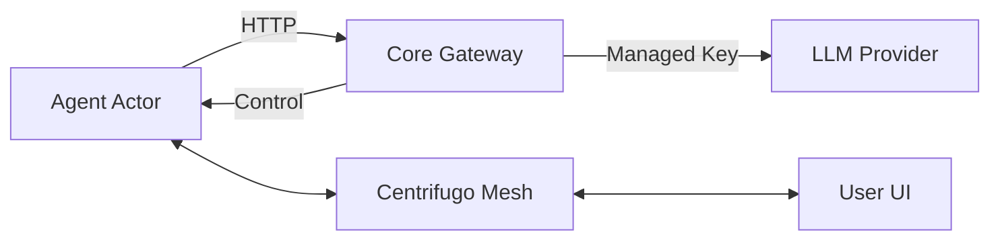

# 01 Architecture & Topology

The core of SERA v2 is the separation of **Infrastructure** from **Reasoning**.

## Distributed Actor Model

Currently, `sera-core` orchestrates everything by "driving" the agent's logic. In v2, the agent becomes a sovereign **Actor** that drives itself.

### The Two Pillars

| Component | Role | Description |
| :--- | :--- | :--- |
| **Core Gateway** | Controller | Manages lifecycles, auth, storage, and external API proxying. |
| **Agent Actor** | Executor | Runs the autonomous reasoning loop locally within the sandbox. |

---

## Technical Topology

### 1. The Reasoning Loop (Inside the Container)
The Agent Actor container includes the `agent-runtime`. This runtime:
1.  Loads the `AGENT.yaml`.
2.  Connects to the Centrifugo Mesh.
3.  Streams thoughts and observations.
4.  Invokes tools natively (no `docker exec` latency).

### 2. The Communication Mesh
We use **Centrifugo** as the persistent event bus.
- **Thought Channels**: `internal:agent:{id}:thoughts` (Real-time reasoning).
- **Intercom Channels**: `intercom:{circle}:{from}:{to}` (Direct agent messaging).
- **Control Channels**: `control:instance:{command}` (System-wide lifecycle events).

### 3. The Proxy Gateway
The `sera-core` service serves as a security airlock.
- **LLM Proxy**: Prevents agents from seeing raw API keys.
- **Identity Proxy**: Handles JWT handshakes for external services.
- **Storage Management**: Attaches host volumes or cloud storage to the containers before they start.

---

## Data Flow Diagram

