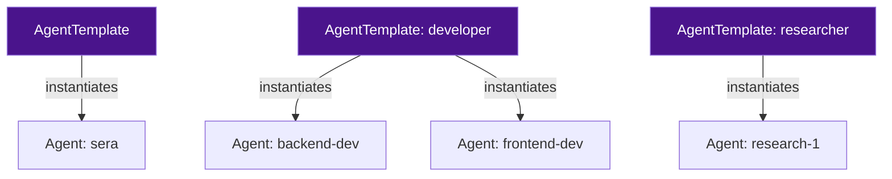
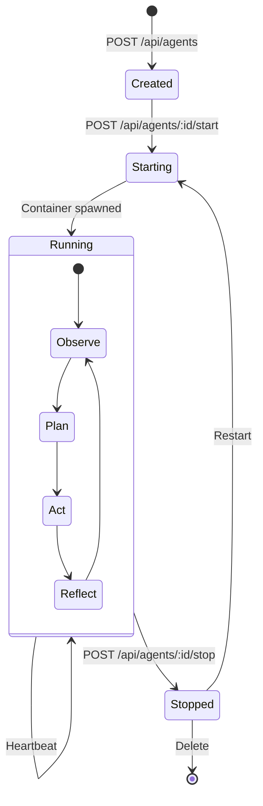

# Agent Architecture

## Two-Tier Model: Templates and Instances

Agents follow a class/instance separation. Templates are reusable blueprints; agents are named instances with their own identity and lifecycle.



### AgentTemplate

Reusable blueprints that define defaults for identity, model, tools, skills, sandbox boundary, and capability policy. Templates ship with the installation (`builtin: true`) or are created by operators.

```yaml
apiVersion: sera/v1
kind: AgentTemplate
metadata:
  name: developer
  displayName: Developer Agent
  builtin: false
  category: engineering
spec:
  identity:
    role: 'Senior software engineer'
    principles:
      - 'Always write tests alongside implementation'
  model:
    provider: lmstudio
    name: qwen2.5-coder-7b
  sandboxBoundary: tier-2
  policyRef: developer-standard
  lifecycle:
    mode: persistent
  skills:
    - typescript-best-practices
    - git-workflow
  tools:
    allowed: [file-read, file-write, shell-exec, knowledge-store]
```

### Agent (Instance)

A named instance derived from a template. Holds overrides on top of template defaults.

```yaml
apiVersion: sera/v1
kind: Agent
metadata:
  name: backend-dev
  templateRef: developer
  circle: engineering
overrides:
  model:
    name: qwen2.5-coder-32b
  resources:
    maxLlmTokensPerHour: 200000
  skills:
    $append:
      - agentic-coding-v1
```

**Resolution:** `template spec` merged with `instance overrides` — overrides win on conflict. Post-instantiation, `PATCH /api/agents/:id` modifies the overrides block; the template is never mutated.

## Lifecycle Modes

| Property                    | Persistent                          | Ephemeral                         |
| --------------------------- | ----------------------------------- | --------------------------------- |
| DB record                   | Stable, survives restarts           | Exists only during run            |
| Memory                      | Own namespace, persisted            | Task-scoped, not persisted        |
| Visible in UI               | Yes                                 | No (visible in parent's log)      |
| Config editable             | Yes (via PATCH)                     | No — locked at spawn              |
| Started by                  | Operator, CLI, Sera, API            | Parent agent via `spawn-subagent` |
| On completion               | Container stopped, record preserved | Container and record auto-removed |
| Can spawn persistent agents | With capability grant               | Never                             |

## Agent Lifecycle



### Startup Sequence

1. **Resolve capabilities** — Boundary intersect Policy intersect Manifest inline
2. **Create workspace** — bind mount at `/workspace/`
3. **Spawn container** — Docker create with security context, network, env vars
4. **Inject identity** — JWT token, `SERA_CORE_URL`, capability config
5. **Start reasoning loop** — agent-runtime reads task, calls LLM, executes tools
6. **Publish status** — heartbeat and thoughts stream to Centrifugo

## Sera — The Primary Agent

Sera is the built-in primary agent, auto-instantiated on first boot. She:

- Orchestrates the SERA instance
- Creates and manages other agents
- Handles natural-language interaction with the platform
- Has `seraManagement` capabilities for agent, circle, schedule, and channel management
- Can spawn ephemeral subagents (researcher, developer, architect)

Sera's template ships in `templates/builtin/sera.template.yaml` with a detailed identity, personality, and set of scheduled self-improvement activities.
