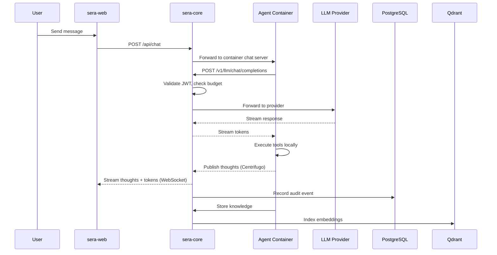

# Architecture Overview

SERA is structured around a clear separation of concerns: a central orchestrator (sera-core), isolated agent containers, and a set of infrastructure services that provide persistence, real-time messaging, and vector search.

## Design Principles

- **Agents are first-class isolated processes**, not library calls
- **LLM access is always proxied** through sera-core (metering, budget enforcement, circuit breaking)
- **The Docker socket is held exclusively by sera-core** — agents cannot spawn containers unless explicitly permitted
- **All agent actions produce an auditable, Merkle-chained event record**
- **Deny always wins** — at every layer of the capability model

## Components

| Component                                    | Technology              | Role                                                  |
| -------------------------------------------- | ----------------------- | ----------------------------------------------------- |
| [sera-core](components.md#sera-core)         | Node.js 22 + TypeScript | Orchestrator, LLM proxy, governance, all API surfaces |
| [sera-web](components.md#sera-web)           | Vite + React Router v7  | Operator dashboard, real-time thought streams         |
| [Agent runtime](components.md#agent-runtime) | TypeScript (bun)        | Reasoning loop inside each agent container            |
| [LlmRouter](llm-routing.md)                  | In-process (pi-mono)    | Multi-provider LLM gateway                            |
| [Centrifugo](messaging.md)                   | Go binary               | Real-time pub/sub for thoughts and agent status       |
| [PostgreSQL](components.md#infrastructure)   | 15 + pgvector           | Primary store + embedding index                       |
| [Qdrant](memory.md)                          | Rust binary             | Dedicated vector store for semantic memory            |
| [Egress Proxy](../EGRESS-ENFORCEMENT.md)     | Squid                   | Per-agent network filtering and audit                 |

## Data Flow

## Key Architectural Decisions

Significant decisions are recorded as ADRs in the [Decisions](../adrs/README.md) section. Key highlights:

- **In-process LLM routing** over a sidecar proxy (ADR: simpler deployment, lower latency)
- **Bun runtime for agent containers** over Node.js (faster cold start, native TypeScript)
- **Skills as documents** over executable code (cleaner separation, no sandbox escape risk)
- **Git-backed circle knowledge** over database-only (provenance, conflict resolution, rebuild-from-source)
- **Three-layer capability model** over role-based (fine-grained, composable, deny-wins)

## Deep Dives

- [Component Architecture](components.md) — detailed module breakdown
- [Agent Architecture](agents.md) — templates, instances, lifecycle
- [LLM Routing](llm-routing.md) — provider gateway and budget enforcement
- [Docker Sandbox](sandbox.md) — container isolation and security
- [Capability Model](capabilities.md) — three-layer permission system
- [Memory & RAG](memory.md) — knowledge storage and retrieval
- [Real-Time Messaging](messaging.md) — Centrifugo integration

For the full canonical reference (all details in one document), see the [Architecture Reference](../ARCHITECTURE.md).
