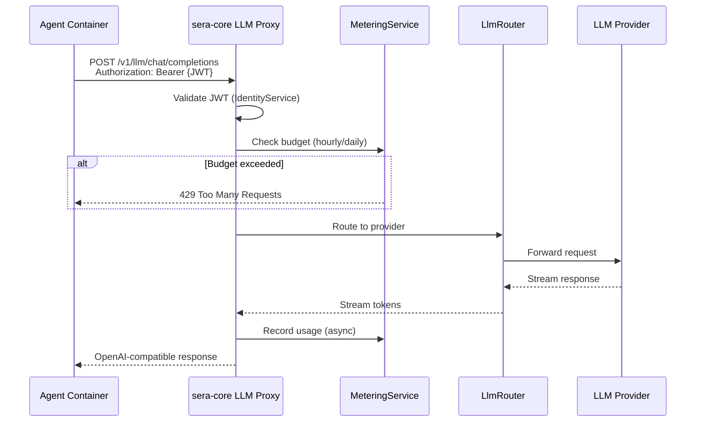

# LLM Routing

All LLM calls in SERA are proxied through sera-core. Agents never call upstream providers directly.

## Why Proxy Everything

- **Metering** — every token counted against per-agent budgets, enforced before the call
- **Provider abstraction** — agents declare a model name; sera-core resolves the endpoint and API key
- **Circuit breaking** — sera-core can throttle or pause any agent without touching the container
- **Audit** — LLM calls are part of the audit trail
- **Key vaulting** — upstream API keys never touch agent containers

## Request Flow



## Provider Gateway

LLM routing is handled in-process by `LlmRouter` → `ProviderRegistry` → `@mariozechner/pi-ai` (pi-mono). There is no external LLM sidecar.

### Provider Configuration

Provider config lives in `core/config/providers.json`. Cloud providers are auto-detected by model name prefix:

| Prefix     | Provider  | API Key Env Var                      |
| ---------- | --------- | ------------------------------------ |
| `gpt-*`    | OpenAI    | `OPENAI_API_KEY`                     |
| `claude-*` | Anthropic | `ANTHROPIC_API_KEY`                  |
| `gemini-*` | Google    | `GOOGLE_API_KEY` or `GEMINI_API_KEY` |

Local providers (LM Studio, Ollama) are registered with a `baseUrl`:

```json
{
  "modelName": "qwen3.5-35b-a3b",
  "provider": "lmstudio",
  "baseUrl": "http://host.docker.internal:1234/v1"
}
```

### Bootstrap Mode

`LLM_BASE_URL` + `LLM_MODEL` env vars bootstrap a single default provider without a config file — the simplest way to get started.

### Provider Management API

```
POST   /api/providers           → Add provider (hot-reload, no restart)
DELETE /api/providers/{name}    → Remove provider
GET    /api/providers           → List all configured models
```

All changes are hot-reloadable. The dashboard Settings page is the primary interface for provider management.

## Budget Enforcement

Each agent has configurable token budgets:

| Budget | Default          | Enforcement                     |
| ------ | ---------------- | ------------------------------- |
| Hourly | 100,000 tokens   | Pre-call check, 429 if exceeded |
| Daily  | 1,000,000 tokens | Pre-call check, 429 if exceeded |

A budget of `0` means unlimited. Budgets are set per-agent via the manifest or `PATCH /api/budget/agents/:id/budget`.

## Reasoning Model Support

Models that emit `reasoning_content` (Qwen3, DeepSeek-R1, o1/o3) need `reasoning: true` in `providers.json`. Pi-mono maps `reasoning_content` to `thinking_delta` events, and the agent-runtime maps these to the thought stream.

!!! warning "Thinking models can be slow"
The thinking phase for large reasoning models (35B+) can take 2+ minutes before content arrives. The agent-runtime handles this with extended timeouts and retry logic.
