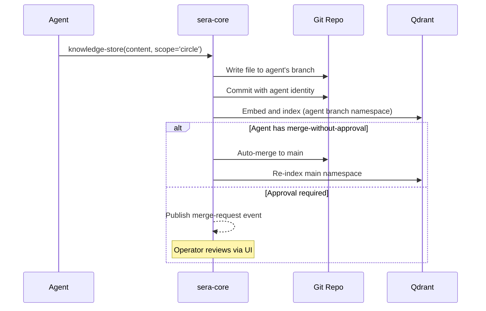

# Memory & RAG

SERA provides a multi-scope memory system combining file-based block storage, git-backed shared knowledge, and vector search.

## Memory Scopes

| Scope        | Backing                | Git-tracked | Writers               | Readers        |
| ------------ | ---------------------- | ----------- | --------------------- | -------------- |
| **Personal** | Files per agent        | No          | Owning agent          | Owning agent   |
| **Circle**   | Git repo per circle    | Yes         | Circle members        | Circle members |
| **Global**   | System circle git repo | Yes         | Sera + granted agents | All agents     |

**Global knowledge** is the system circle's knowledge base — not a separate mechanism. The system circle is built-in; all agents have read access.

## Storage Layers

| Layer                     | Technology                         | Purpose                                |
| ------------------------- | ---------------------------------- | -------------------------------------- |
| Personal block store      | YAML front-matter + Markdown files | Human-readable personal memory         |
| Circle/global block store | Git repo per circle                | Versioned shared knowledge             |
| Relational                | PostgreSQL                         | Chat history, agent records, schedules |
| Embedding index           | pgvector (768-dim)                 | Fast approximate search                |
| Semantic store            | Qdrant                             | Primary vector store, namespaced       |

## Knowledge Tools

Agents interact with memory through two built-in tools:

### `knowledge-store`

```typescript
{
  content: string,        // The knowledge to store
  scope: 'personal' | 'circle' | 'global',
  category?: string,      // e.g., 'observation', 'decision', 'reference'
  tags?: string[],
  title?: string
}
```

### `knowledge-query`

```typescript
{
  query: string,           // Natural language query
  scope: 'personal' | 'circle' | 'global' | 'all',
  limit?: number,          // Default: 5
  minScore?: number,       // Similarity threshold
  filter?: {
    category?: string,
    tags?: string[]
  }
}
```

## Git-Backed Circle Knowledge

Each circle's shared knowledge is a git repository managed by `KnowledgeGitService`:



Each agent commits with its own git identity: `Agent-Name <sera-agent-{id}@{instanceId}>`. This provides full provenance and attribution.

## Embedding Pipeline

1. Content arrives via `knowledge-store` tool
2. `EmbeddingService` generates vectors (default: `nomic-embed-text`, 768 dimensions)
3. Vectors stored in Qdrant under namespace `{scope}:{id}`
4. pgvector index maintained in parallel for SQL-based queries

!!! warning "Changing embedding models"
If you switch embedding models (different dimensions), Qdrant collections must be dropped and recreated. The git repo is the source of truth — vectors can always be rebuilt.

## Context Assembly

When an agent starts a reasoning step, `ContextAssembler` builds the context window:

1. System prompt (identity, skills, instructions)
2. Relevant knowledge retrieved from memory (RAG)
3. Chat history (with compaction if needed)
4. Current task context

Knowledge retrieval uses semantic search across the agent's accessible scopes (personal + circle + global).
