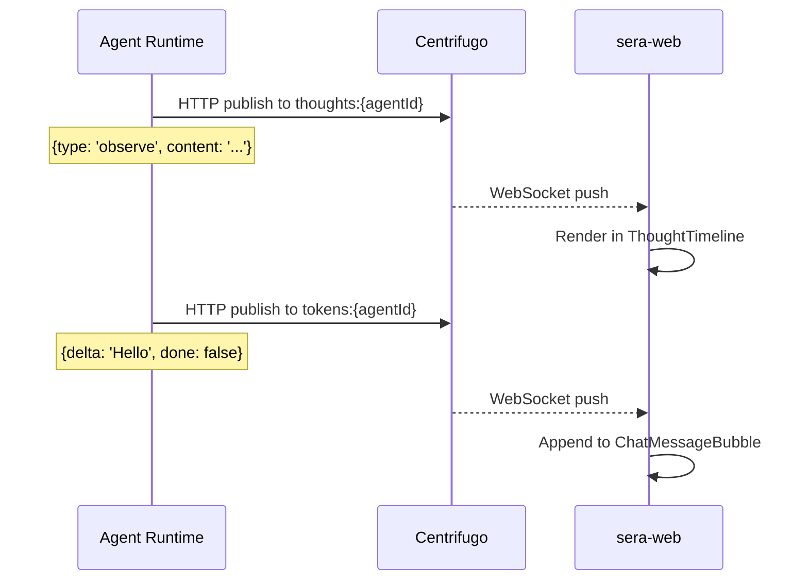

# Real-Time Messaging

SERA uses Centrifugo for real-time communication between agents, sera-core, and the web dashboard.

## Channel Architecture

Centrifugo is configured with namespaced channels:

| Namespace  | Purpose                                     | History            | Client Subscribe |
| ---------- | ------------------------------------------- | ------------------ | ---------------- |
| `thoughts` | Agent reasoning steps                       | 100 msgs, 1h TTL   | Yes              |
| `tokens`   | Token streaming during chat                 | None               | Yes              |
| `agent`    | Agent status updates                        | 10 msgs, 10min TTL | Yes              |
| `system`   | System events (permission requests, alerts) | 20 msgs, 30min TTL | Yes              |
| `private`  | Private agent-to-agent messaging            | 100 msgs, 1h TTL   | No (server-side) |
| `circle`   | Circle broadcast channels                   | 50 msgs, 4h TTL    | No (server-side) |

## Channel Naming

| Purpose               | Channel Pattern                | Example                |
| --------------------- | ------------------------------ | ---------------------- |
| Agent status          | `agent:{agentId}:status`       | `agent:abc123:status`  |
| Token streaming       | `tokens:{agentId}`             | `tokens:abc123`        |
| Thought stream        | `thoughts:{agentId}`           | `thoughts:abc123`      |
| Permission requests   | `system.permission-requests`   | —                      |
| Secret entry requests | `system.secret-entry-requests` | —                      |
| Circle broadcast      | `circle:{circleId}:{channel}`  | `circle:eng:decisions` |

## How Thoughts Stream

The agent-runtime publishes directly to Centrifugo via its HTTP API — it does not go through sera-core for thought streaming. This reduces latency and load on the API server.

## Authentication

Centrifugo uses JWT tokens (HMAC-SHA256) for client authentication. sera-core generates subscription tokens for the web dashboard via `IntercomService`.

The token secret is configured in `centrifugo/config.json` under `client.token.hmac_secret_key` and must match `CENTRIFUGO_TOKEN_SECRET` in sera-core.

## IntercomService

`IntercomService` in sera-core provides a higher-level API for:

- Publishing messages to any channel
- Managing agent-to-agent direct messaging
- Broadcasting circle events
- Subscribing to system events (permission requests, delegation requests)

It wraps the Centrifugo HTTP API and handles JWT token generation for client subscriptions.
