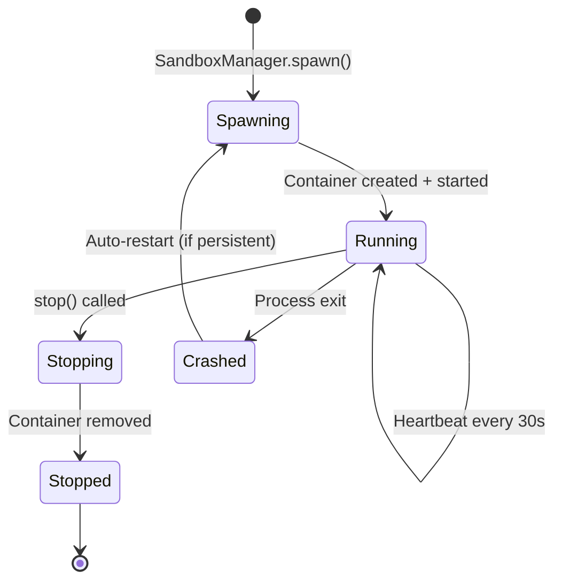

# Docker Sandbox Model

Every agent runs in an isolated Docker container managed by `SandboxManager`. The container's capabilities, network access, and resource limits are determined by the resolved capability set.

## Container Configuration

Each agent container receives:

- **Bind mount** of its workspace directory (`/workspace/`)
- **JWT token** for authenticating with sera-core
- **Environment variables** for sera-core URL, Centrifugo URL, context window config
- **Network configuration** based on resolved capabilities
- **HTTP/HTTPS proxy** environment variables pointing to the egress proxy
- **Resource limits** (CPU, memory) from the template/manifest

## Workspace Isolation

```
Host:       /workspaces/{agent-name}/
Container:  /workspace/  (read/write per resolved capability)
```

For coding tasks where multiple agents work on the same repo, SERA uses **git worktrees**:

```
Repository:
  main/                           ← base branch, read-only reference
  .worktrees/
    agent-xyz-task-abc/           ← worktree for this agent's task
    agent-def-task-xyz/           ← another agent, another branch
```

Benefits: no file interference, every change on a named branch, shared git object store.

## Network Isolation

Network access is a first-class capability dimension:

| Resolved capability               | Docker config                        | Effect                     |
| --------------------------------- | ------------------------------------ | -------------------------- |
| `network.outbound.allow: []`      | `--network none`                     | Complete isolation         |
| `network.outbound.allow: [hosts]` | `--network agent_net` + egress proxy | Filtered access            |
| `network.outbound.allow: ["*"]`   | `--network agent_net` + egress proxy | Unrestricted (but audited) |

All agents with network access route through the egress proxy. There is no direct bridge mode — even unrestricted agents go through the proxy for audit.

## Egress Proxy

The Squid forward proxy (`sera-egress-proxy`) on `agent_net` centralises:

- **SNI-based domain filtering** (no TLS MITM, no CA cert needed)
- **Per-agent ACLs** generated by `EgressAclManager` from resolved capabilities
- **Bandwidth rate limiting** via Squid `delay_pools`
- **Structured access logging** tailed by `EgressLogWatcher` for audit integration
- **Egress metering** (per-agent bytes and request counts)

See the [Egress Enforcement](../EGRESS-ENFORCEMENT.md) document for implementation details.

## Security Context

`ContainerSecurityMapper` translates the sandbox boundary into Docker security options:

| Boundary field         | Docker equivalent            |
| ---------------------- | ---------------------------- |
| `linux.capabilities`   | `--cap-add`                  |
| `linux.seccomp`        | `--security-opt seccomp=...` |
| `linux.readonlyRootfs` | `--read-only`                |
| `linux.runAsNonRoot`   | `--user`                     |

## Container Lifecycle



`SandboxManager` handles the full lifecycle: capability resolution, bind mount assembly, container creation, health monitoring, and cleanup.
