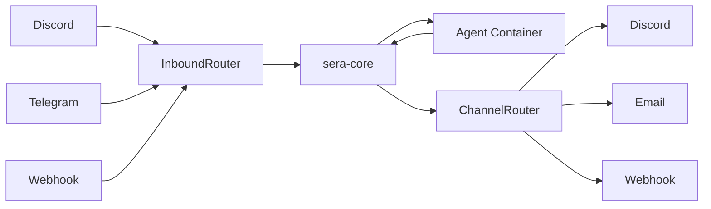

# Channels & Integrations

SERA connects agents to external messaging platforms through a unified channel model. Channels handle both inbound messages (users reaching agents) and outbound notifications (agents reaching users).

## Supported Channels

| Channel      | Status      | Features                                                     |
| ------------ | ----------- | ------------------------------------------------------------ |
| **Web Chat** | Implemented | Full chat with thought streaming, session persistence        |
| **Discord**  | Implemented | DMs, session management, typing indicators, chunked messages |
| **Telegram** | Implemented | Adapter available                                            |
| **Slack**    | Implemented | Adapter available                                            |
| **Email**    | Implemented | Outbound notification adapter                                |
| **Webhooks** | Implemented | Inbound/outbound HTTP webhooks                               |
| **WhatsApp** | Implemented | Adapter available                                            |

## Channel Architecture



### Inbound Flow

External messages arrive via channel adapters, get routed to the appropriate agent, and processed through the agent's reasoning loop.

### Outbound Flow

Agents can send notifications, permission requests, and alerts through configured channels via `NotificationService`.

## Channel Configuration

Channels are configured via the dashboard or API:

```bash
curl -X POST http://localhost:3001/api/channels \
  -H "Authorization: Bearer $API_KEY" \
  -d '{
    "type": "discord",
    "name": "ops-discord",
    "config": {
      "botTokenSecret": "discord-ops-token"
    }
  }'
```

!!! note "Secrets are never in agent context"
Channel secrets (bot tokens, API keys) are stored in the encrypted secrets store. Agents reference secrets by name — they never see the actual values. See [Prompt Injection Defence](security.md) for the security model.

## Action Tokens

For interactive workflows (e.g., permission approval via Discord), SERA uses JWT-based action tokens:

1. Agent requests a permission → sera-core publishes to notification channels
2. The channel adapter sends a message with action buttons/links
3. Operator clicks "Approve" → the link contains a signed action token
4. sera-core validates the token and processes the decision

This enables human-in-the-loop workflows across any messaging platform.

## Routing Rules

Operators can configure routing rules to direct specific event types to specific channels:

| Event               | Channel            | Example                                   |
| ------------------- | ------------------ | ----------------------------------------- |
| Permission requests | Discord #ops       | Agent asks to access a new file path      |
| Budget alerts       | Email              | Agent approaching daily token limit       |
| Task completions    | Webhook            | Notify external systems of completed work |
| Circle broadcasts   | Slack #engineering | Cross-agent coordination messages         |
