# SERA 2.0 — Architecture Diagrams

> **Companion to:** [plan.md](plan.md) (PRD v0.3) · [Spec Index](specs/README.md)  
> **Purpose:** Visual reference for reasoning about the system  
> **Date:** 2026-04-10

---

## 1. The Big Picture

Everything in SERA flows through a single control plane — the **Gateway**. Clients and external channels push events in; the gateway routes them to agent harnesses; harnesses think, act, and respond. The gateway handles channel binding, session persistence, auth, config, etc. Harnesses are exchangeable workers connected via a transport layer (stdin/out, gRPC, etc.).

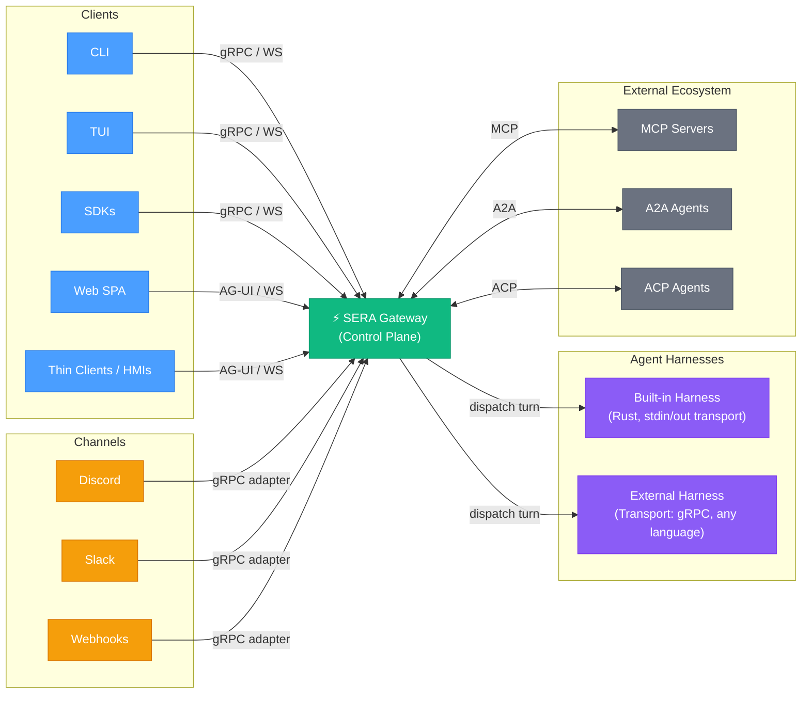

---

## 2. Gateway Internals

The gateway process itself is **stateless** to enable seamless horizontal scaling. All durability requirements (queues, active sessions, metadata) are delegated to a **pluggable storage plane** (which defaults simply to the local file system or SQLite for local dev, but scales to Redis and PostgreSQL for production). While the gateway process is stateless, it owns the central *logic* for routing, queuing, sessions, auth, scheduling, and hook orchestration.

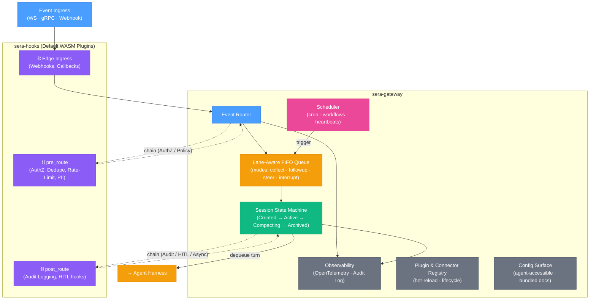

- **Ultra-Slim Core**: The Gateway isolates the heavy logic (Dedupe, Auth, HITL Escalation, Credential Injection) purely into default WASM Plugins (`sera-hooks`), keeping the core focused uniquely on queueing, scaling, and state machine lifecycle.
- **Lane-aware queue**: One writer per session (no races), global concurrency cap
- **Hook chains shape behavior**: `Edge` hooks process direct webhooks, `pre_route` hooks filter and authenticate before queuing, and `post_route` hooks handle async tasks like HITL approvals and custom audit logging.
- **Scheduler** drives cron jobs, dreaming workflows, and heartbeat checks

---

## 3. Agent Harness — The Turn Loop

The harness is the "thinking + doing" worker. It is **stateless per-turn** and **session-scoped**. We provide a built-in harness, but effectively they are exchangeable. Harnesses can run on the same machine, but they don't have to — they are connected to the gateway via a transport layer (which can be as basic as stdin/out, or gRPC).

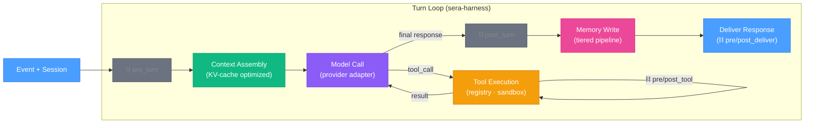

The inner tool loop may cycle multiple times (agent decides when it's done).

---

## 4. Context Engineering

> **Guiding principle:** Find the **smallest set of high-signal tokens** that maximize the likelihood of the desired outcome. Context is a finite attention budget with diminishing marginal returns — every token added costs attention elsewhere.
>
> _Ref: [Anthropic — Effective Context Engineering for AI Agents](https://www.anthropic.com/engineering/effective-context-engineering-for-ai-agents)_

### The Problem

LLMs suffer from **context rot**: as token count increases, the model's ability to recall and reason over information degrades. This isn't a hard cliff but a performance gradient — models remain capable at longer contexts but show reduced precision. The context engine's job is to fight this by curating what enters the window at each turn.

### Entry & Exit Contract

The **Context Engine** is a pluggable trait. The harness hands it a `TurnContext` and gets back a `ContextWindow` — it doesn't care how context is assembled.

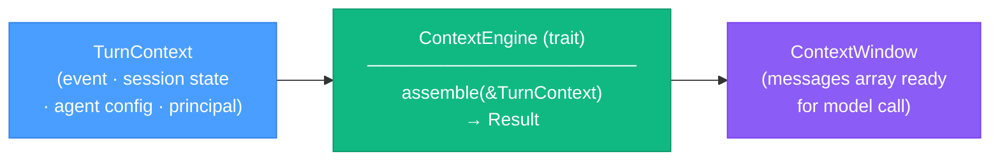

```rust
#[async_trait]
pub trait ContextEngine: Send + Sync {
    async fn assemble(&self, ctx: &TurnContext) -> Result<ContextWindow, ContextError>;
    fn describe(&self) -> EngineDescription;
}
```

Any implementation — default pipeline, LCM-based, RAG-heavy, domain-specific — plugs in here.

### The Context Window (what the model actually sees)

Each turn, the engine assembles a fresh context window. This is what gets sent to the LLM:

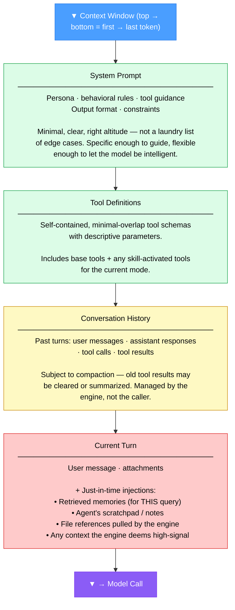

This is simply what LLM APIs expect: system message, then turn history, then the current turn. The interesting part is the **strategies** the engine uses to decide what goes into each section and how to keep it tight.

### Four Strategies for Managing the Attention Budget

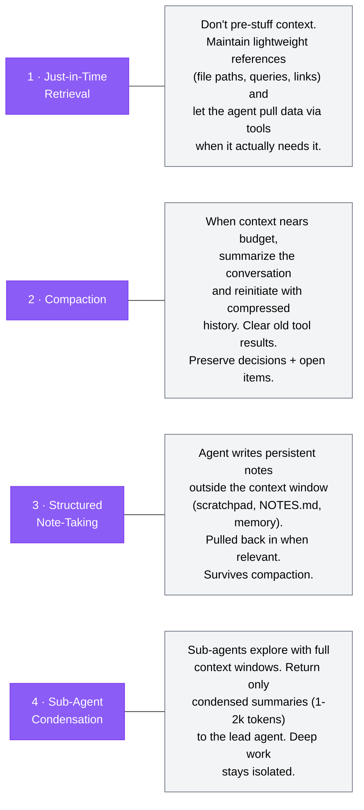

**How these map to SERA components:**

| Strategy | SERA Component | How It Works |
|---|---|---|
| **Just-in-time retrieval** | `sera-memory` (search tool), `sera-tools` (file/grep tools) | Agent maintains references; pulls context via tool calls when needed. Memory search is a _tool_, not automatic injection. Progressive disclosure through exploration. |
| **Compaction** | `ContextEngine` + `sera-session` | Engine monitors token budget. When threshold is hit: summarize history, clear old tool results, preserve key decisions. Flush-before-discard invariant ensures nothing is lost. |
| **Structured note-taking** | `sera-memory` (write tool), agent scratchpad | Agent writes notes/todos to persistent memory. Engine can inject recent notes into the current turn's context. Notes survive compaction. |
| **Sub-agent condensation** | `sera-harness` (sub-agent dispatch) | Lead agent spawns sub-agents for deep exploration. Sub-agents return condensed results. Lead agent's context stays clean. |

### What "Pluggable" Means in Practice

The `ContextEngine` trait lets different implementations choose different strategy mixes:

| Implementation | Strategy Mix | Use Case |
|---|---|---|
| **Default engine** | System prompt + history + just-in-time tools + compaction | General-purpose agent work |
| **RAG-heavy engine** | Embedding search pre-fills context with relevant docs | Knowledge-base Q&A, support bots |
| **LCM/DAG engine** | Hierarchical summaries with drill-down tools | Long-horizon research, analysis |
| **Minimal engine** | System prompt + current turn only (no history) | Stateless classification, one-shot tasks |

The harness doesn't care which engine is used — it gets a `ContextWindow` and sends it to the model.

### Compaction (Pluggable Strategies)

Compaction is a turn-layer operation with pluggable strategies. It can be triggered automatically or manually, and _how_ compaction works is itself swappable.

**Triggers:**

| Trigger | How | Example |
|---|---|---|
| **Budget limit** | Context engine detects token/turn count nearing configured threshold | `compaction.trigger.max_tokens: 80000` |
| **User command** | User enters a `/compact` or `/reset` command | `/compact` in chat or CLI |
| **Hook / API** | A hook, tool, or external API call requests compaction | Pre-turn hook checks policy and fires compaction |

**The trait:**

```rust
#[async_trait]
pub trait CompactionStrategy: Send + Sync {
    /// Compact the session history into a shorter representation
    async fn compact(
        &self,
        history: &[Turn],
        config: &CompactionConfig,
    ) -> Result<CompactedContext, CompactionError>;

    fn name(&self) -> &str;
}
```

**Built-in strategies:**

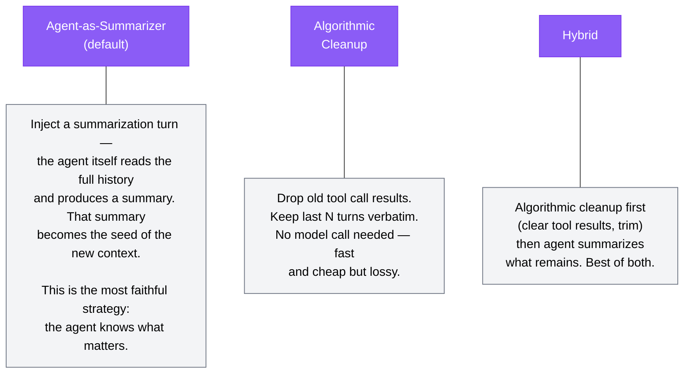

**Agent-as-Summarizer flow:**

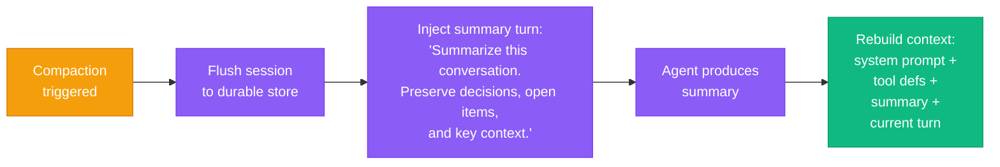

The flush-before-discard invariant ensures the full session transcript is persisted before any context is discarded — compaction is lossy by design, but nothing is truly lost.

---

## 5. The Hook System — Chainable WASM Pipelines

Hooks are **sandboxed WASM modules** that form ordered pipeline chains. One hook's output feeds into the next. Hooks can execute synchronous data mutations, asynchronous deferrals, or short-circuit routing entirely with `Reject` or `Redirect`. 

For security, hooks are restricted from making arbitrary raw network connections (`no host FS/net`). If a hook needs to query an external component (e.g., verifying a token against an external identity provider or spam-check service), it calls a designated Host API. The sera-gateway then acts as a **proxy**, executing the HTTP request against an approved allow-list. This guarantees hooks are strictly bounded extension points but remain fully capable.

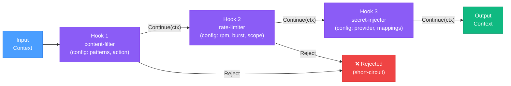

### Hook Points Across the System

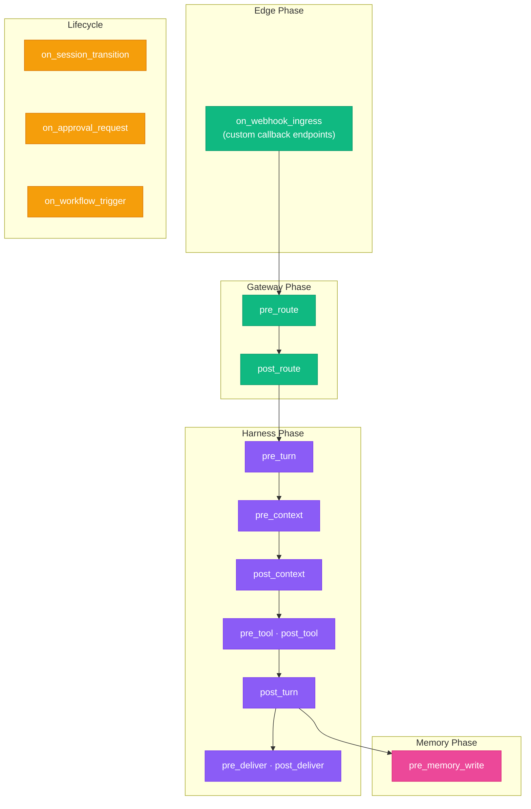

---

## 6. Memory System — Pluggable & Tiered

Memory is a **pluggable workflow**, not a monolithic store. Different agents can use different backends. The default is file-based (Karpathy llm-wiki pattern), with optional auto-git.

### Integration Points

Following Anthropic's context engineering principles, memory is **not** automatically stuffed into the context window by the engine. Instead, it integrates at two specific layers:

1. **Tool Layer (Just-in-Time Retrieval):** The agent is equipped with memory tools (`memory_search`, `memory_write`, `memory_recall`). During its turn, the agent decides _when_ to search its memory and _what_ to retrieve. This enables progressive disclosure and preserves the context budget.
2. **Workflow Layer (Background Processing):** Memory is maintained by asynchronous, triggered workflows outside the critical turn loop (e.g., Compaction, Dreaming, Knowledge Audits).

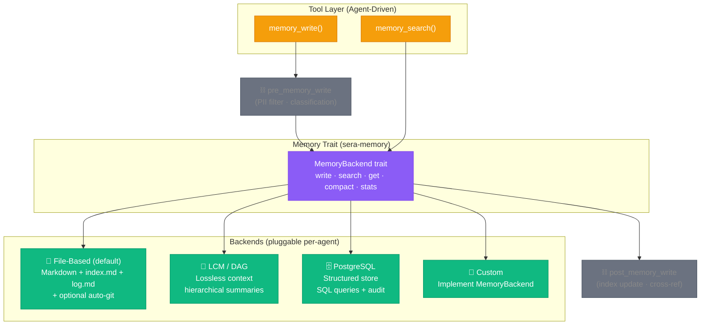

### Dreaming — Background Memory Consolidation

Dreaming is a **built-in triggered workflow** that runs on a cron schedule (default: 3 AM). It consolidates short-term signals into durable long-term knowledge through three phases.

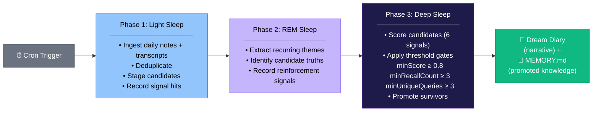

---

## 7. Identity & Authorization

**Principals**, not just users. Any acting entity — human, agent, service, external agent — is a Principal with identity, credentials, and authorization.

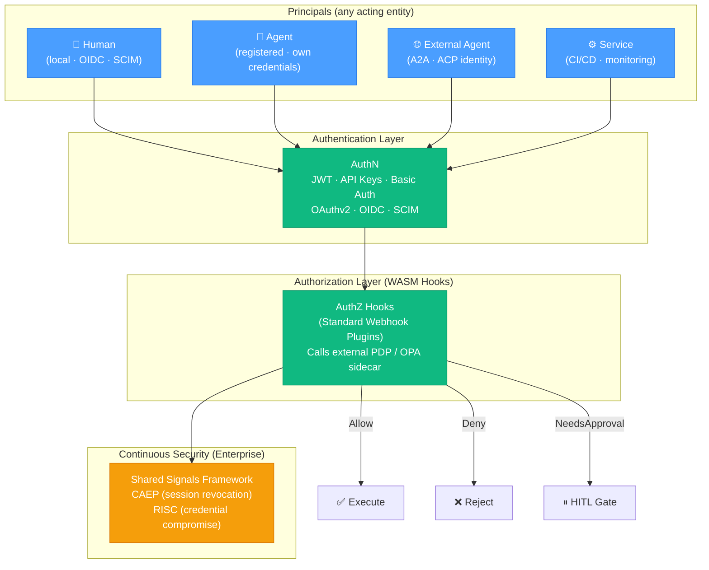

### HITL Approval Escalation

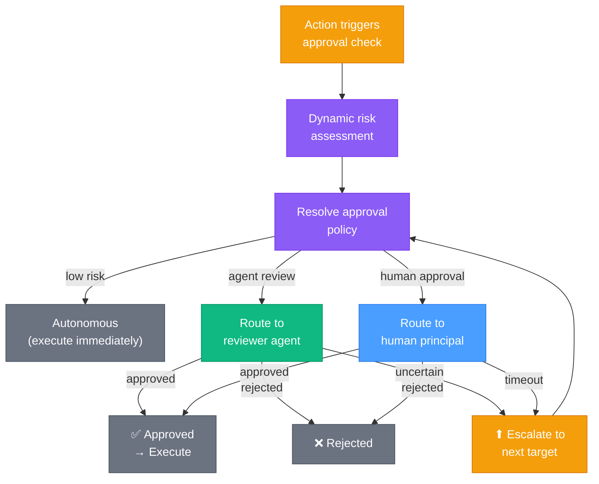

---

## 8. Interoperability — Protocol Integration

SERA is protocol-native. It speaks the emerging agent ecosystem standards so agents can participate in multi-agent networks beyond the SERA boundary.

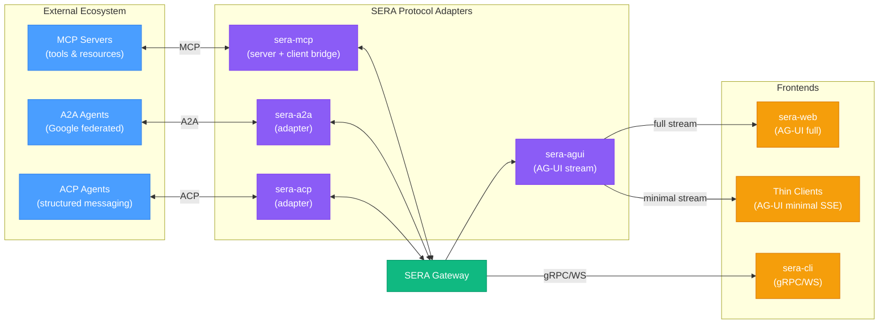

---

## 9. Crate Dependency Graph

The Rust workspace is decomposed into layers with clear dependency flow. Foundation crates at the bottom, the gateway binary at the top.

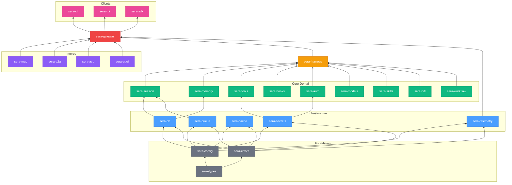

---

## 10. Deployment Spectrum

SERA scales from a single binary on a laptop to a multi-node enterprise cluster. Same codebase, different config.

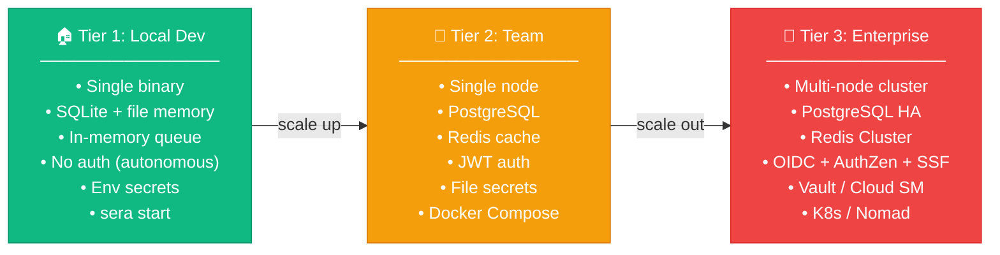

---

## 11. Security Trust Boundaries

Three trust zones with clear boundaries. The WASM sandbox lives _inside_ the trusted core but is fuel-metered and memory-capped.

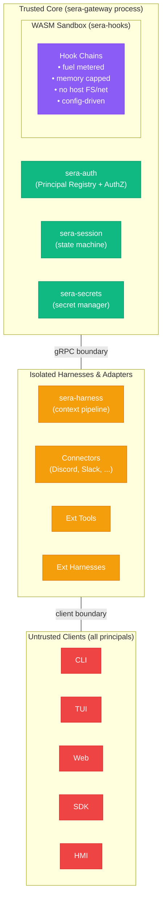

---

## 12. End-to-End Request Flow

A complete request lifecycle — from client message to delivered response.

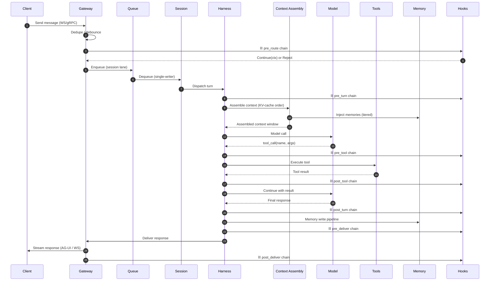

---

## 13. Multi-Agent Coordination — Circles

Circles organize agents in a DAG hierarchy (like an org chart). Each circle has a coordination policy.

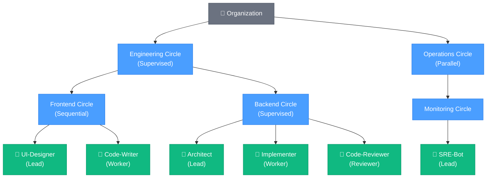

---

## Legend

| Symbol | Meaning |
|---|---|
| ⛓ | Hook chain (WASM pipeline) — fires at this point |
| → (solid) | Data / control flow |
| ⇢ (dashed) | Hook invocation (side-effect) |
| 🟢 | Stable (high KV cache reuse) |
| 🟡 | Semi-stable |
| 🔴 | Volatile (changes every turn) |
