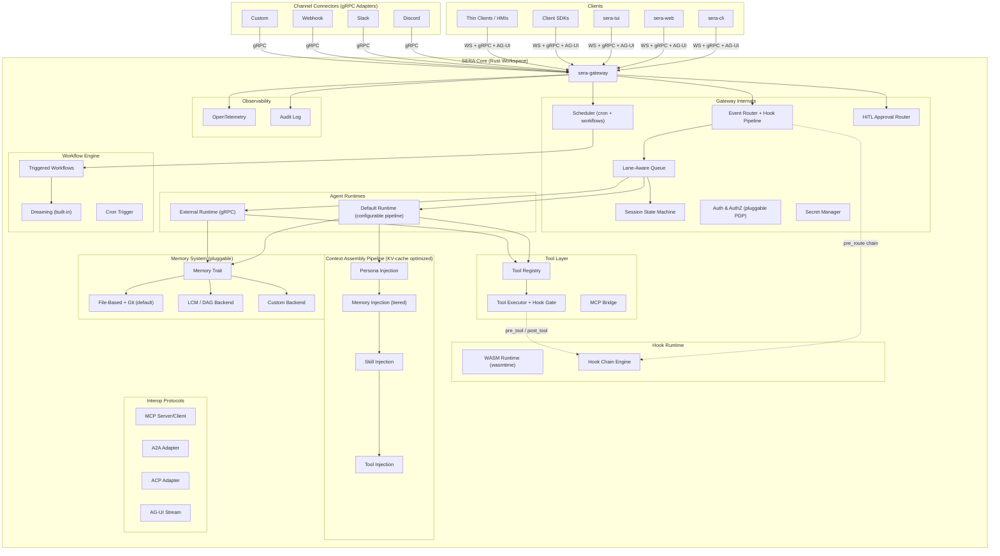
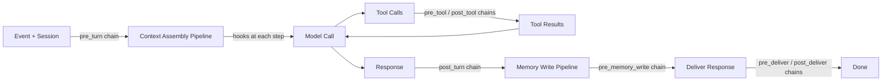
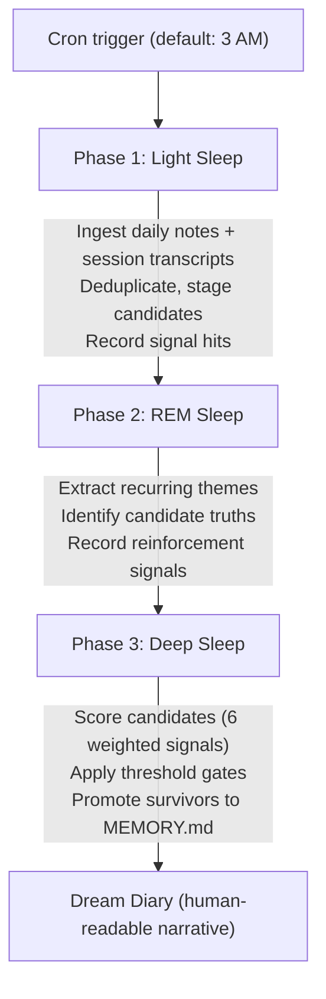
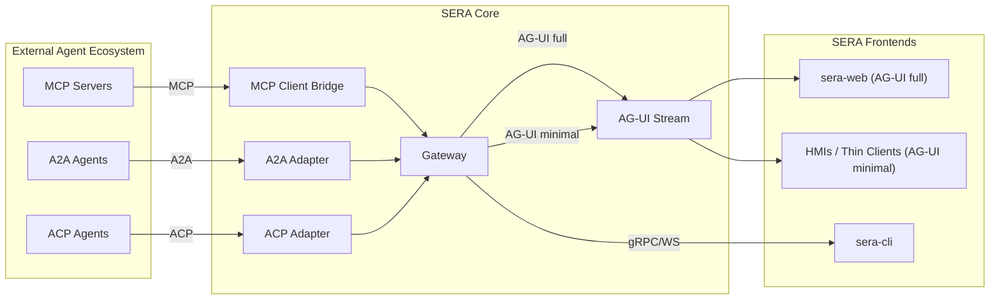
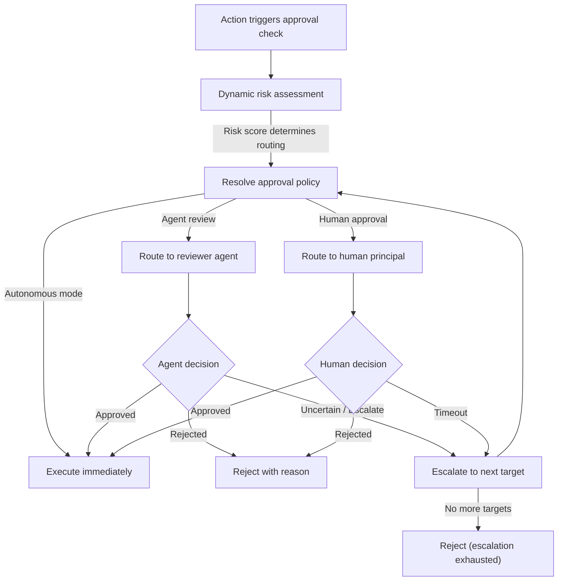
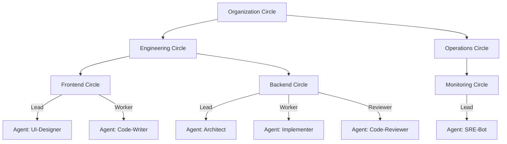
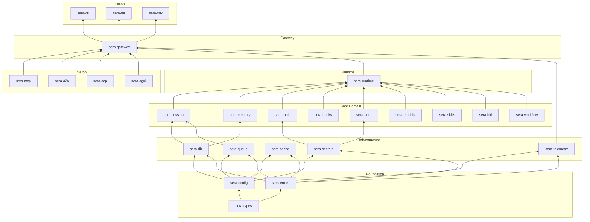
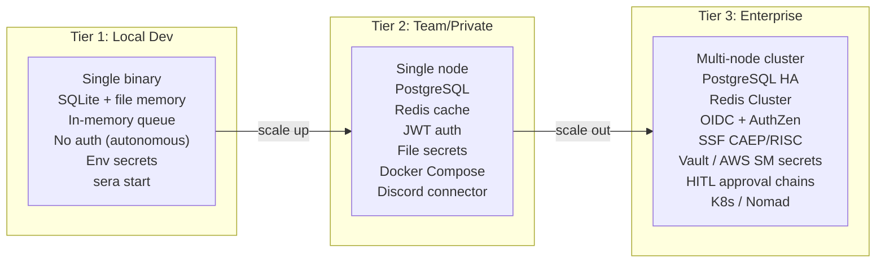

# SERA Rust Core — Product Requirements Document (PRD)

> **Status:** DRAFT v0.3 — iterating  
> **Date:** 2026-04-09  
> **Scope:** Full architectural pivot from TypeScript monolith to modular Rust workspace  

---

## 1. Vision & Goal

SERA (Sandboxed Extensible Reasoning Agent) becomes an **enterprise-grade, multi-user agent platform** built as a decomposed Rust workspace. The core is an incredibly extensible but robust and secure harness that is easy to operate locally as a single binary, but can scale horizontally into complex enterprise use cases (multi-node, failover, shop-floor factory brain).

### Design Philosophy

| Principle | Meaning |
|---|---|
| **Simple by default, extensible for enterprise** | Zero-config local start; every extension point is opt-in |
| **Constraints first** | Security, isolation, and invariants are enforced by the system, not by prompts |
| **Extensibility through interfaces** | Every major component boundary is a trait + gRPC service |
| **Hooks via WASM** | Pre/post processing hooks run in a sandboxed WASM runtime (wasmtime), chainable via config, parameterized via config |
| **Deployment spectrum** | Single binary local → containerized → multi-node cluster with leader election |
| **State ownership** | Every piece of state has exactly one owner, one durable home, and one rehydration path |
| **Self-bootstrapping** | Configure an LLM provider + create an agent → the agent helps bootstrap the rest |
| **Principals, not just users** | Any acting entity (human, agent, service) is a **Principal** with identity, credentials, and authorization |

### Bootstrap Flow

The first-run experience must be dead simple:

```
sera init                    # Interactive: pick LLM provider, set API key
sera agent create "sera"     # Create a default agent with basic tools
sera start                   # Agent is ready — it can help configure the rest
```

The configuration layer is agent-accessible: a running agent can read and propose changes to its own config, tool assignments, memory settings, and skill packs. Approval requirements are **configurable** — from fully autonomous (private sandbox) to multi-approval enterprise gates. This means the system bootstraps itself once you have `provider + model + agent`.

> [!NOTE]
> SERA ships with locally-accessible documentation (bundled markdown in the workspace) so that an agent running on the instance can consume the docs to help users configure the system. A user can ask the agent: *"add a Discord connector"* and the agent reads the docs, proposes the config change, and (if approval policy allows) applies it.

---

## 2. Architectural Reference

This architecture synthesizes proven patterns from [The Agent Stack](https://theagentstack.substack.com/) series, [ZeroClaw](https://github.com/openagen/zeroclaw) (trait-driven Rust agent runtime), [OpenClaw](https://github.com/openclaw/openclaw) (personal AI assistant), [Lossless Claw / LCM](https://github.com/martian-engineering/lossless-claw) (lossless context management), [Paperclip](https://github.com/paperclipai/paperclip) (multi-agent org orchestration), [OpenClaw Dreaming](https://dev.to/czmilo/openclaw-dreaming-guide-2026-background-memory-consolidation-for-ai-agents-585e) (background memory consolidation), and Karpathy's [llm-wiki](https://gist.github.com/karpathy/442a6bf555914893e9891c11519de94f) (file-based cumulative knowledge).

| Pattern | Source | SERA Application |
|---|---|---|
| Gateway as control plane | Agent Stack P1, P4 | Central event router, session owner, policy enforcer |
| Lane-aware FIFO queue | Agent Stack P2 | Single-writer per session, global concurrency throttle |
| Queue modes (collect/followup/steer) | Agent Stack P2 | Configurable mid-flight message handling |
| Memory = state ownership + rehydration | Agent Stack P3 | Durable store + tool-shaped retrieval |
| Flush-before-discard invariant | Agent Stack P3 | Pre-compaction memory checkpoint |
| Capability tiers, not flat tool list | Agent Stack P5 | Tool profiles with allow/deny |
| Evidence-based observability | Agent Stack P6 | Structured traces, proof bundles |
| Trait-driven architecture | ZeroClaw | Every component is a swappable trait |
| DAG-based lossless context | Lossless Claw / LCM | Pluggable memory backend option |
| Wiki as compiled knowledge | Karpathy llm-wiki | File-based memory as default backend |
| Dreaming (background consolidation) | OpenClaw Dreaming | Built-in workflow: Light → REM → Deep sleep memory promotion |
| Org charts and agent coordination | Paperclip | Circle DAG model for multi-agent orchestration |
| KV cache prefix optimization | vLLM / SGLang | Context assembly ordered for maximum KV cache hits |

---

## 3. System Architecture Overview



---

## 4. Core Components

### 4.1 The Gateway (`sera-gateway`)

The central component. All input and output flows through it. It is the **control plane and source of truth**.

**Responsibilities:**
- Event ingress and egress routing **with hook pipeline support** (pre_route / post_route chains)
- Session lifecycle management via **configurable state machine** with hook transitions
- Lane-aware FIFO queue with configurable modes (collect, followup, steer, interrupt)
- Global concurrency throttle (`max_concurrent_runs`)
- Authentication and authorization enforcement for **all principals** (humans, agents, services) supporting **OAuthv2, OIDC, SCIM** for identity provisioning, **AuthZen** for pluggable external authorization, and **Shared Signals Framework (SSF)** with **CAEP** (Continuous Access Evaluation Protocol) and **RISC** (Risk Incident Sharing and Coordination) events for continuous security posture
- Inbound message deduplication and debouncing
- **Scheduler** for cron jobs, heartbeats, and triggered workflows (including dreaming)
- Hook trigger orchestration (chainable pipelines via WASM runtime)
- Webhook ingress and webhook trigger dispatch
- Channel connector registry with **identity mapping** (e.g., one Discord bot token → one agent identity) and lifecycle management
- **Plugin registry** with dynamic registration and hot-reloading
- **Secret management** with pluggable secret providers (see Section 10.3)
- Health, status, and diagnostics endpoints with **OpenTelemetry** support
- **HITL approval routing** (see Section 9)
- **Configuration management surface** accessible to principals for self-bootstrapping
- **Bundled documentation** accessible to agents running on the instance

#### Session State Machine

> [!IMPORTANT]
> Session lifecycle is a **configurable state machine** with hook transitions. The default states and transitions ship out of the box, but operators can define custom states and hook-driven transitions for domain-specific workflows.

```rust
/// Default session states — extensible via config
pub enum SessionState {
    Created,
    Active,
    WaitingForApproval,  // HITL gate
    Compacting,
    Suspended,
    Archived,
    Destroyed,
}

/// State transitions are hook-driven
pub struct SessionTransition {
    pub from: SessionState,
    pub to: SessionState,
    pub hook_chain: Vec<HookRef>,     // Chainable hooks fire on transition
    pub condition: Option<TransitionCondition>,
}
```

**Event Model:**
```rust
pub struct Event {
    pub id: EventId,
    pub kind: EventKind,          // Message, Heartbeat, Cron, Webhook, Hook, System, Approval, Workflow
    pub source: EventSource,      // Channel, Scheduler, API, Internal, A2A, ACP
    pub context: EventContext,    // agent_id, session_key, sender, recipient, principal, metadata
    pub payload: EventPayload,
    pub timestamp: DateTime<Utc>,
    pub idempotency_key: Option<String>,
    pub requires_approval: Option<ApprovalSpec>, // HITL trigger
    pub principal: PrincipalRef,  // The acting entity (human, agent, or service)
}
```

### 4.2 Agent Runtime(s) (`sera-runtime`)

The worker that does the "thinking + doing." Isolated, stateless per-turn, session-scoped.

**The default runtime is itself highly configurable** — its internal components (context assembly, tool/skill exposure, memory injection, subagent management) are all pluggable and hook-enabled.

**Core Loop (with hook points):**



#### Context Assembly Pipeline (KV Cache Optimized)

> [!IMPORTANT]
> Context assembly **must be ordered to maximize KV cache prefix hits** across turns within a session. Segments that remain stable across turns (system prompt, persona, tool schemas, long-term memory) are placed at the **front** of the context window. Segments that change per-turn (recent history, current query, dynamic context) are placed at the **tail**. This ordering ensures that LLM serving engines with prefix caching (vLLM, SGLang, TensorRT-LLM, etc.) can reuse the KV cache from previous turns, drastically reducing time-to-first-token.

Context assembly is a **configurable multi-step pipeline** where each step has hook support:

```rust
/// Each step in the pipeline is a trait implementation, swappable per-agent
pub struct ContextPipeline {
    pub steps: Vec<Box<dyn ContextStep>>,
}

#[async_trait]
pub trait ContextStep: Send + Sync {
    fn name(&self) -> &str;
    /// Position hint for KV cache optimization — lower = more stable = placed earlier
    fn stability_rank(&self) -> u32;
    async fn execute(&self, ctx: &mut TurnContext, hooks: &HookChain) -> Result<(), PipelineError>;
}
```

**Default ordering (KV cache optimized — stable first, volatile last):**

| Order | Step | Stability | Hookable | Rationale |
|---|---|---|---|---|
| 1 | **Persona Injection** | 🟢 Stable | ✅ | System prompt, personality — rarely changes within a session |
| 2 | **Tool Injection** | 🟢 Stable | ✅ | Available tool schemas — changes only on policy updates |
| 3 | **Skill Injection** | 🟡 Semi-stable | ✅ | Active skills, mode context — changes on mode transition |
| 4 | **Memory Injection** | 🟡 Semi-stable | ✅ | Long-term memory excerpts — changes on memory writes |
| 5 | **History Injection** | 🔴 Volatile | ✅ | Session transcript (sliding window) — grows each turn |
| 6 | **Current Turn** | 🔴 Volatile | ✅ | The current user message and dynamic context |
| 7 | **Custom Steps** | Configurable | ✅ | User-defined enrichment — stability hint configurable |

> [!TIP]
> The `stability_rank()` on each `ContextStep` allows custom steps to declare their own caching affinity. The pipeline sorts by stability rank before assembly, ensuring optimal prefix sharing even with custom context enrichment.

#### Runtime Trait (pluggable via gRPC)

```rust
#[async_trait]
pub trait AgentRuntime: Send + Sync {
    async fn execute_turn(&self, ctx: TurnContext) -> Result<TurnResult, RuntimeError>;
    async fn capabilities(&self) -> RuntimeCapabilities;
    async fn health(&self) -> HealthStatus;
}
```

The **default runtime** has many internally pluggable/configurable components. External runtimes (Python, specialized domains) implement the gRPC `AgentRuntimeService` and register with the gateway.

### 4.3 Tools (`sera-tools`)

Where chat becomes action. Capability exposure is separated from execution authority.

**Design Principles:**
- Tools are **capability proposals**, not execution grants
- Tool profiles (minimal, coding, messaging, full) + allow/deny lists, **wired to the gateway authz system via hooks**
- Execution targets are explicit (sandbox, local, remote node)
- Tool results re-enter the runtime loop before final response — **with hook support** at re-entry
- Tools support **credential injection via hooks** (e.g., inject OAuth tokens, API keys, agent-specific secrets) for traceable agent identity. Credentials are resolved through the **Secret Manager** (Section 10.3)
- **Pre-tool hooks** for risk checks, approval gates, argument validation
- **Post-tool hooks** for result sanitization, audit, compliance

```rust
#[async_trait]
pub trait Tool: Send + Sync {
    fn metadata(&self) -> ToolMetadata;
    fn schema(&self) -> ToolSchema;
    async fn execute(&self, input: ToolInput, ctx: ToolContext) -> Result<ToolOutput, ToolError>;
    fn risk_level(&self) -> RiskLevel;  // Read, Write, Execute, Admin
}

/// Tool context includes injected credentials and principal identity
pub struct ToolContext {
    pub session: SessionRef,
    pub principal: PrincipalRef,      // The acting principal (may be agent or human)
    pub credentials: CredentialBag,    // Populated by Secret Manager + pre_tool hooks
    pub policy: ToolPolicy,
    pub audit_handle: AuditHandle,
}
```

### 4.4 Clients

| Client | Type | Protocol | Primary Use |
|---|---|---|---|
| `sera-cli` | Terminal | gRPC + WS | Developer / operator interaction |
| `sera-tui` | Rich TUI (ratatui) | gRPC + WS | Interactive local operation |
| `sera-web` | SPA (rebuild) | WS + AG-UI stream | Browser-based multi-agent management |
| Client SDKs | Library | gRPC + WS | Programmatic integration |
| **Thin Clients / HMIs** | Embedded | AG-UI (minimal) | Factory HMIs, kiosks, embedded displays |

> [!NOTE]
> **AG-UI on thin clients:** The AG-UI streaming protocol is designed to be consumable by thin / embedded clients as well — not just the full `sera-web` SPA. Think factory floor HMIs that display agent status, accept approvals, and show streaming responses. The AG-UI adapter in `sera-agui` should expose a minimal event stream that any HTTP/SSE-capable client can consume. This is an architectural consideration for design — not necessarily a high-priority implementation target.

**Protocol support:** Both WebSocket (for streaming, AG-UI compat) and gRPC streaming are supported. WS is simpler for web clients and wide compatibility; gRPC streaming is better for inter-service and high-throughput. They coexist on the same gateway.

---

## 5. Hook System (Chainable WASM Pipelines)

> [!IMPORTANT]
> Hooks are **chainable via configuration**. One hook's output is passed into the next. The chain can short-circuit at any point with `Reject` or `Redirect`. Hooks accept **parameters and configuration** — they are not hardcoded. Each hook instance in a chain has its own config block.

### 5.1 Hook Chain Architecture

```rust
/// A hook chain is an ordered pipeline of WASM hooks
pub struct HookChain {
    pub name: String,
    pub hooks: Vec<HookInstance>,      // Ordered — output of N feeds into N+1
    pub timeout: Duration,             // Total chain timeout
    pub fail_open: bool,               // If a hook fails: true = continue, false = reject
}

/// A hook instance = a WASM module + its configuration
pub struct HookInstance {
    pub hook_ref: HookRef,             // Reference to the WASM module
    pub config: serde_json::Value,     // Per-instance configuration (parameters)
    pub enabled: bool,                 // Can be toggled without removing from chain
}

/// Hooks implement this interface, compiled to WASM
pub trait Hook {
    fn metadata(&self) -> HookMetadata;
    /// Initialize with configuration — called once on load
    fn init(&mut self, config: serde_json::Value) -> Result<(), HookError>;
    /// Execute with context — called per invocation
    fn execute(&self, ctx: HookContext) -> HookResult;
}

pub enum HookResult {
    Continue(HookContext),    // Pass through (possibly modified) to next in chain
    Reject(RejectReason),     // Short-circuit: block the event/action
    Redirect(RedirectTarget), // Short-circuit: reroute to different session/agent
}
```

### 5.2 Hook Configuration (parameterized, not hardcoded)

```yaml
hooks:
  chains:
    pre_route:
      - hook: "content-filter"
        config:
          blocked_patterns: ["spam_regex_1", "spam_regex_2"]
          action: "reject"
          log_level: "warn"
      - hook: "rate-limiter"
        config:
          requests_per_minute: 60
          burst: 10
          scope: "per-principal"    # per-principal | per-session | global
    pre_tool:
      - hook: "secret-injector"
        config:
          provider: "vault"          # env | file | vault | aws-sm
          mappings:
            GITHUB_TOKEN: "secrets/github/token"
            SLACK_WEBHOOK: "secrets/slack/webhook"
      - hook: "risk-checker"
        config:
          max_risk_level: "write"    # read | write | execute | admin
          require_approval_above: "execute"
    post_turn:
      - hook: "pii-redactor"
        config:
          patterns: ["email", "phone", "ssn"]
          action: "mask"            # mask | remove | flag
```

### 5.3 Hook Points (comprehensive)

| Hook Point | Fires When | Chainable | Use Cases |
|---|---|---|---|
| `pre_route` | After event ingress, before queue | ✅ | Content filtering, rate limiting, classification |
| `post_route` | After routing decision, before enqueue | ✅ | Routing override, logging |
| `pre_turn` | After queue dequeue, before context assembly | ✅ | Context enrichment, policy injection |
| `context_persona` | During persona assembly step | ✅ | Persona switching, mode injection |
| `context_memory` | During memory injection step | ✅ | Memory tier selection, RAG tuning |
| `context_skill` | During skill injection step | ✅ | Skill filtering, mode transitions |
| `context_tool` | During tool injection step | ✅ | Tool filtering, capability policy |
| `pre_tool` | Before tool execution | ✅ | Approval gates, argument validation, **secret injection** |
| `post_tool` | After tool execution | ✅ | Result sanitization, audit, **risk assessment** |
| `post_turn` | After runtime, before response delivery | ✅ | Response filtering, compliance, redaction |
| `pre_deliver` | Before response delivery to client/channel | ✅ | Final formatting, channel-specific transforms |
| `post_deliver` | After response delivery confirmed | ✅ | Analytics, notification triggers |
| `pre_memory_write` | Before durable memory write | ✅ | Content policy, PII filtering |
| `on_session_transition` | On session state machine transition | ✅ | Lifecycle hooks, cleanup, notification |
| `on_approval_request` | When HITL approval is triggered | ✅ | Routing to correct approver, escalation logic |
| `on_workflow_trigger` | When a scheduled/triggered workflow fires | ✅ | Workflow gating, context injection |

### 5.4 WASM Runtime Configuration

```rust
pub struct WasmConfig {
    pub fuel_limit: u64,              // Computation budget per hook invocation
    pub memory_limit_mb: u32,         // Memory cap per hook instance
    pub timeout: Duration,            // Per-hook timeout
    pub hot_reload: bool,             // Watch hook directory for changes
    pub hook_directory: PathBuf,      // Where .wasm files live
}
```

**Hook authoring:** Standard WASM toolchains — we provide lightweight interface SDK crates for **Rust**, **Python** (via componentize-py), and **TypeScript** (via ComponentizeJS/jco). Authors compile to WASM Components using their standard build tools.

---

## 6. Memory System (Pluggable, Tiered)

> [!IMPORTANT]
> The memory system is **not a monolith** — it is a **pluggable workflow** that can be different per agent. The default is file-based (inspired by Karpathy's llm-wiki pattern and beads task graph), but the architecture supports LCM-style DAG compaction, knowledge graphs, and database-backed stores as switchable backends.

### 6.1 Memory Trait

```rust
#[async_trait]
pub trait MemoryBackend: Send + Sync {
    /// Store a memory entry
    async fn write(&self, entry: MemoryEntry, ctx: &MemoryContext) -> Result<MemoryId, MemoryError>;
    
    /// Search memories (may trigger a workflow: embed → search → rank → expand)
    async fn search(&self, query: &MemoryQuery, ctx: &MemoryContext) -> Result<Vec<MemoryResult>, MemoryError>;
    
    /// Get a specific memory by ID
    async fn get(&self, id: &MemoryId) -> Result<MemoryEntry, MemoryError>;
    
    /// Compact/summarize older memories (implementation-specific)
    async fn compact(&self, scope: &CompactionScope) -> Result<CompactionResult, MemoryError>;
    
    /// Health and stats
    async fn stats(&self) -> MemoryStats;
}
```

### 6.2 Built-in Backends

| Backend | Description | Tier | Default |
|---|---|---|---|
| **File-Based** | Markdown files in agent workspace, indexed by heading hierarchy. LLM-maintained wiki pattern with `index.md` + `log.md`. Integrates with [beads](https://github.com/gastownhall/beads) task graph. **Optional auto-git management** (see 6.4). | 1, 2 | ✅ |
| **LCM / DAG** | DAG-based lossless context management (inspired by [lossless-claw](https://github.com/martian-engineering/lossless-claw)). Persists every message, builds hierarchical summaries, tools for drill-down (`search`, `describe`, `expand`). | 2, 3 | ❌ |
| **Database** | PostgreSQL-backed structured store for enterprise deployments requiring SQL queries, audit trails, and relational integrity. | 3 | ❌ |
| **Custom** | Implement the `MemoryBackend` trait for domain-specific storage. | Any | ❌ |

### 6.3 Memory as a Workflow (including Dreaming)

Memory operations (especially write and compact) can be **full workflows**, not just CRUD. More importantly, the memory system supports **triggered background workflows** — long-running agent-driven processes that run on schedules or in response to events.

#### Write Workflow

```
write_request 
  → pre_memory_write hook chain (PII filter, classification, dedup)
  → tier decision (short-term session vs. long-term workspace)
  → backend.write()
  → post_memory_write hook chain (index update, cross-reference, notification)
  → optional: trigger compaction if threshold exceeded
```

#### Triggered Workflows (General System)

> [!IMPORTANT]
> Managing memory may require a **full autonomous system** with scheduled workflows that cause the agent to review, consolidate, expand, and reorganize its own knowledge. The architecture provides a **general triggered workflow system** that is not limited to memory — it can power any agent-driven background task.

```rust
/// A workflow is a named, configurable, trigger-driven agent task
pub struct WorkflowDef {
    pub name: String,                    // e.g., "dreaming", "knowledge-audit", "inbox-triage"
    pub trigger: WorkflowTrigger,
    pub agent: AgentRef,                 // Which agent executes this workflow
    pub config: serde_json::Value,       // Workflow-specific configuration
    pub enabled: bool,
    pub hook_chain: Option<HookChainRef>, // Optional hook chain on trigger
}

pub enum WorkflowTrigger {
    Cron(CronSchedule),                  // "0 3 * * *" — daily at 3 AM
    Event(EventPattern),                 // On specific event types
    Threshold(ThresholdCondition),       // When memory size exceeds X, session count > N, etc.
    Manual,                              // Triggered by principal via API/CLI
}
```

#### Dreaming (Built-in Workflow)

Dreaming is a **built-in workflow** (inspired by [OpenClaw's dreaming system](https://dev.to/czmilo/openclaw-dreaming-guide-2026-background-memory-consolidation-for-ai-agents-585e)) that consolidates short-term memory signals into durable long-term knowledge. It runs as a three-phase background sweep:



**Scoring signals (6 weighted):**

| Signal | Weight | Meaning |
|---|---|---|
| Relevance | 0.30 | How relevant to the agent's domain |
| Frequency | 0.24 | How often recalled |
| Query diversity | 0.15 | Recalled by diverse queries (not just one) |
| Recency | 0.15 | Recency-weighted (half-life decay) |
| Consolidation | 0.10 | Already part of consolidated knowledge |
| Conceptual richness | 0.06 | Connects multiple concepts |

**Promotion gates (all must pass):** `minScore ≥ 0.8`, `minRecallCount ≥ 3`, `minUniqueQueries ≥ 3`

**Configuration:**
```yaml
agents:
  - name: "sera"
    workflows:
      dreaming:
        enabled: true              # Opt-in, disabled by default
        frequency: "0 3 * * *"     # Cron schedule
        phases:
          light:
            lookback_days: 2
            limit: 100
          rem:
            lookback_days: 7
            min_pattern_strength: 0.75
          deep:
            min_score: 0.8
            min_recall_count: 3
            min_unique_queries: 3
            max_age_days: 30
            limit: 10
```

> [!TIP]
> Dreaming is just one example of a triggered workflow. The same system can power: **knowledge audits** (agent reviews its own memory for staleness), **inbox triage** (agent processes accumulated messages), **workspace cleanup** (agent organizes its files), or any domain-specific background task. Workflows are agent-executed — they produce turns, use tools, and write memory, subject to all the same hooks and policies as interactive turns.

### 6.4 File-Based Memory with Optional Git Management

> [!NOTE]
> The file-based memory backend supports **optional automatic git management** — every write, compaction, and dreaming promotion can be auto-committed with structured commit messages. This provides full versioned history of memory evolution, rollback capability, and the ability to review memory changes via standard git tooling.

```yaml
agents:
  - name: "sera"
    memory:
      backend: "file"
      git:
        enabled: true                # Auto-commit memory changes
        auto_commit: true
        commit_template: "[sera-memory] {operation}: {description}"
        branch: "memory/sera"        # Dedicated branch for memory changes
        push_remote: null             # Optional: push to remote for backup
```

Git management is implemented at the **memory backend level** — no hooks required. The file-based backend wraps git operations around write and compact calls. This is transparent to the rest of the system.

---

## 7. Interoperability Protocols

> [!IMPORTANT]
> SERA is protocol-native. It speaks the emerging agent ecosystem standards so agents can participate in multi-agent networks beyond the SERA boundary.

| Protocol | What | SERA Role | Crate |
|---|---|---|---|
| **MCP** (Model Context Protocol) | Tool & resource exposure to LLMs | Server (expose SERA tools to external agents) + Client (consume external MCP servers as tools) | `sera-mcp` |
| **ACP** (Agent Communication Protocol) | Structured agent-to-agent messaging | Adapter — SERA agents can send/receive ACP messages via the gateway | `sera-acp` |
| **A2A** (Agent-to-Agent, Google) | Federated agent discovery and task delegation | Adapter — SERA agents can discover and delegate to external A2A agents | `sera-a2a` |
| **AG-UI** (Agent-User Interaction, CopilotKit) | Frontend streaming protocol for agent UIs | Server — gateway streams AG-UI events for `sera-web`, **thin clients**, and compatible frontends | `sera-agui` |
| **AgentSkills** | Skill pack format and discovery | Native — SERA's skill system is compatible with the AgentSkills spec | `sera-skills` |

> [!NOTE]
> **AG-UI on thin clients:** The `sera-agui` crate should expose both a full event stream (for `sera-web`) and a **minimal SSE/HTTP event stream** suitable for embedded HMIs, factory displays, and other thin clients. These thin clients may only need: streaming text, approval prompts, and status updates. The architectural contract should accommodate this from day one, even if thin client support ships later.

### Protocol Integration Points



---

## 8. Identity & Authorization Architecture

> [!IMPORTANT]
> **Principals, not just users.** Any acting entity that needs authentication and authorization is a **Principal**. Humans, agents, services, and external agent identities are all principals. Agents are first-class citizens in the identity system — they have their own credentials, they appear in audit logs, and they can be authorized (or denied) independently.

### 8.1 Principal Model

```rust
/// A Principal is any entity that acts within the system
pub enum Principal {
    Human(HumanPrincipal),        // A human user (local or OIDC-federated)
    Agent(AgentPrincipal),        // An AI agent registered in this SERA instance
    ExternalAgent(ExternalAgentPrincipal), // An agent identity registered from outside (A2A, ACP)
    Service(ServicePrincipal),    // A service account (CI/CD, monitoring, etc.)
}

pub struct HumanPrincipal {
    pub id: PrincipalId,
    pub name: String,
    pub email: Option<String>,
    pub groups: Vec<PrincipalGroupId>,
    pub auth_method: AuthMethod,  // Local, OIDC, SCIM-provisioned
}

pub struct AgentPrincipal {
    pub id: PrincipalId,
    pub agent_id: AgentId,
    pub name: String,
    pub groups: Vec<PrincipalGroupId>,
    pub credentials: AgentCredentials,  // API keys, tokens for tool access
    pub risk_profile: RiskProfile,       // For dynamic authz decisions
}

pub struct ExternalAgentPrincipal {
    pub id: PrincipalId,
    pub protocol: ExternalProtocol,     // A2A, ACP
    pub external_id: String,            // ID in the external system
    pub trust_level: TrustLevel,        // How much we trust this external agent
    pub registered_by: PrincipalRef,    // Who registered this external identity
}
```

### 8.2 Auth Stack

```
┌──────────────────────────────────────────────────────┐
│  Identity Layer (all principals)                      │
│  Local: JWT + API Keys + Basic Auth                   │
│  Enterprise: OAuthv2, OIDC, SCIM provisioning         │
│  Agents: Registered principal with own credentials    │
│  External: A2A/ACP agent identity registration        │
├──────────────────────────────────────────────────────┤
│  Authorization Layer                                  │
│  Local: Built-in RBAC (roles + permissions)           │
│  Enterprise: AuthZen PDP integration                  │
│  + Hook-contributed authz checks at any point         │
│  + Dynamic risk-based assessment                      │
├──────────────────────────────────────────────────────┤
│  Continuous Security Posture                          │
│  Enterprise: Shared Signals Framework (SSF)           │
│  CAEP events (session revocation, compliance)         │
│  RISC events (credential compromise, user risk)       │
└──────────────────────────────────────────────────────┘
```

### 8.3 AuthZ Trait (Pluggable PDP)

```rust
#[async_trait]
pub trait AuthorizationProvider: Send + Sync {
    /// Check if a principal is authorized to perform an action on a resource
    async fn check(
        &self,
        principal: &Principal,    // Any acting entity — human, agent, service, external
        action: &Action,          // Read, Write, Execute, Admin, ToolCall(name)
        resource: &Resource,      // Session, Agent, Tool, Memory, Config
        context: &AuthzContext,   // Session state, risk score, dynamic signals, etc.
    ) -> Result<AuthzDecision, AuthzError>;
}

pub enum AuthzDecision {
    Allow,
    Deny(DenyReason),
    NeedsApproval(ApprovalSpec),  // Escalate to HITL
}
```

This trait is called at every authorization-relevant point:
- Gateway event ingress (can this principal interact with this agent?)
- Tool execution (can this principal/agent run this tool in this context?)
- Memory access (can this principal read/write this memory scope?)
- Config changes (can this principal modify this agent's config?)
- Session operations (can this principal view/join this session?)
- Workflow triggers (can this principal trigger this workflow?)

WASM hooks can also contribute additional authz checks at any hook point — they receive the authz context and can return `Reject` with a reason.

---

## 9. Human-in-the-Loop (HITL) & Agent-in-the-Loop Approval System

> [!IMPORTANT]
> The approval system is a first-class citizen, not a bolt-on. It supports:
> - **Configurable escalation chains** (subagent → supervisor agent → human)
> - **Agent review and approval** — agents can be approvers, enabling automatic review flows
> - **Dynamic, risk-based routing** — the approval policy engine can make routing decisions based on runtime risk assessment, not just static config
> - **Multi-approval gates** and enterprise policy-driven routing
> - **Configurable enforcement** — from fully autonomous (zero approvals, private sandbox) to strict enterprise (multi-principal approval required)

### 9.1 Approval Model

```rust
pub struct ApprovalSpec {
    pub scope: ApprovalScope,           // ToolCall, SessionAction, MemoryWrite, ConfigChange
    pub description: String,            // Human-readable description of what needs approval
    pub urgency: ApprovalUrgency,       // Low, Medium, High, Critical
    pub routing: ApprovalRouting,       // How to determine the escalation chain
    pub timeout: Duration,              // Before auto-escalation to next in chain
    pub required_approvals: u32,        // For multi-approval gates (e.g., 2-of-3)
    pub evidence: ApprovalEvidence,     // Context for the approver (tool args, risk score, etc.)
}

pub enum ApprovalRouting {
    /// Static chain — always the same approvers in order
    Static(Vec<ApprovalTarget>),
    
    /// Dynamic — resolved at runtime based on risk score, context, policy
    Dynamic(ApprovalPolicy),
    
    /// None — fully autonomous, no approval needed (private sandbox mode)
    Autonomous,
}

pub struct ApprovalPolicy {
    pub risk_thresholds: Vec<RiskThreshold>,  // Different chains for different risk levels
    pub fallback_chain: Vec<ApprovalTarget>,  // If no threshold matches
}

pub struct RiskThreshold {
    pub min_risk_score: f64,
    pub chain: Vec<ApprovalTarget>,
    pub required_approvals: u32,
}

pub enum ApprovalTarget {
    Agent(AgentRef),             // An agent acts as reviewer/approver (agent-in-the-loop)
    Principal(PrincipalRef),     // A specific principal (human or service)
    PrincipalGroup(PrincipalGroupId),  // Any member of a principal group
    Role(RoleName),              // Any principal with this role
    ExternalPDP,                 // Delegate to the AuthZ provider
}
```

### 9.2 Escalation Flow (with Agent Review)



> [!TIP]
> **Combined approvals:** A risk assessment might determine that a low-risk tool call can be approved by a supervisor agent automatically, while a high-risk tool call requires both agent review AND human confirmation. The `required_approvals` field combined with multiple targets in the chain enables this (e.g., `Agent("safety-checker") + User("operator")`, both required).

### 9.3 Enterprise Routing Examples

| Scenario | Risk | Routing | Approval Count |
|---|---|---|---|
| Agent reads a file | Low | `Autonomous` | 0 |
| Agent deletes a file | Medium | `Dynamic → [Agent("safety-checker"), Principal("operator")]` | 1 |
| Agent sends external email | Medium | `Static → [Principal("team-lead")]` | 1 |
| Agent modifies production config | High | `Dynamic → [Role("ops-lead"), Role("security")]` | 2-of-2 |
| Agent executes high-risk tool | High | `Dynamic → [Agent("risk-assessor"), PrincipalGroup("senior-engineers")]` | 2-of-2 |
| Factory agent changes PLC parameters | Critical | `Static → [Principal("floor-supervisor"), Principal("safety-officer")]` | 2-of-2 |

### 9.4 Approval Enforcement Modes

```yaml
sera:
  approval:
    mode: "standard"        # autonomous | standard | strict
    # autonomous: no approvals ever (private sandbox, development)
    # standard: approval policy applies (default)
    # strict: all tool calls require at minimum one approval (high-security enterprise)
```

---

## 10. Configuration Layer

### 10.1 Config Structure

```yaml
# sera.yaml — the primary config file
sera:
  instance:
    name: "my-sera"
    tier: "local"           # local | team | enterprise
    docs_dir: "./docs"      # Bundled documentation accessible to agents
    
  secrets:
    provider: "env"         # env | file | vault | aws-sm | azure-kv | custom
    # See Section 10.3 for full secret provider config
    
  providers:
    - name: "lm-studio"
      kind: "openai-compatible"
      base_url: "http://localhost:1234/v1"
      default_model: "gemma-4-12b"
      
  agents:
    - name: "sera"
      provider: "lm-studio"
      model: "gemma-4-12b"
      persona: "default"
      memory:
        backend: "file"     # file | lcm | postgres | custom 
        git:
          enabled: true     # Auto-commit memory changes
      tools:
        profile: "basic"    # minimal | basic | coding | full | custom
        allow: ["memory_*", "session_*", "shell"]
      skills: ["default"]
      session:
        scope: "per-channel-peer"
        state_machine: "default"
      workflows:
        dreaming:
          enabled: false    # Opt-in
          frequency: "0 3 * * *"
        
  connectors:
    - name: "discord-main"
      kind: "discord"
      token: { secret: "connectors/discord-main/token" }  # Resolved via secret provider
      agent: "sera"         # 1:1 mapping — traceable identity
      
  hooks:
    chains:
      pre_route:
        - hook: "content-filter"
          config:
            blocked_patterns: ["spam"]
            action: "reject"
        - hook: "rate-limiter"
          config:
            requests_per_minute: 60
      pre_tool:
        - hook: "secret-injector"
          config:
            provider: "vault"
        - hook: "risk-checker"
          config:
            max_risk_level: "write"
      post_turn:
        - hook: "pii-redactor"
          config:
            patterns: ["email", "phone"]
            
  approval:
    mode: "standard"        # autonomous | standard | strict
```

### 10.2 Agent-Accessible Config

Principals (including agents) can read their own configuration and propose changes. **Approval is configurable** — a fully sandboxed private deployment may allow agents to apply changes autonomously, while enterprise deployments require human sign-off:

```rust
/// Tools that allow a principal to introspect and propose config changes
pub trait ConfigTools {
    /// Read current config (filtered to what this principal can see)
    async fn config_read(&self, path: &str) -> Result<ConfigValue, ConfigError>;
    
    /// Propose a config change (approval requirements depend on policy)
    async fn config_propose(&self, change: ConfigChange) -> Result<ConfigChangeResult, ConfigError>;
    
    /// Read bundled documentation (for agent self-help)
    async fn docs_read(&self, topic: &str) -> Result<DocContent, ConfigError>;
}

pub enum ConfigChangeResult {
    Applied(ConfigVersion),              // Autonomous mode or auto-approved
    PendingApproval(ApprovalTicket),      // Requires approval
    Rejected(DenyReason),                 // Not authorized
}
```

> [!NOTE]
> **User-initiated agent config:** The user can also ask the agent to make changes: *"add a Slack connector"*. The agent reads the bundled docs, understands the config schema, and proposes the change. This is the same flow as agent-initiated changes — the approval policy determines whether it's auto-applied or needs human confirmation.

### 10.3 Secret Management

> [!IMPORTANT]
> Secrets are **never stored in config files**. SERA provides a pluggable secret management system that supports environment variables (simple), file-based (development), and external secret managers (enterprise).

```rust
#[async_trait]
pub trait SecretProvider: Send + Sync {
    /// Resolve a secret reference to its value
    async fn resolve(&self, reference: &SecretRef) -> Result<SecretValue, SecretError>;
    
    /// List available secret paths (for introspection, not values)
    async fn list_paths(&self, prefix: &str) -> Result<Vec<String>, SecretError>;
    
    /// Health check
    async fn health(&self) -> HealthStatus;
}
```

| Provider | Config | Use Case |
|---|---|---|
| `env` | `SERA_SECRET_<PATH>` env vars | Local development (default) |
| `file` | `secrets/` directory with encrypted files | Development, simple deployments |
| `vault` | HashiCorp Vault (Agent Injector pattern) | Enterprise on-prem |
| `aws-sm` | AWS Secrets Manager | Enterprise cloud (AWS) |
| `azure-kv` | Azure Key Vault | Enterprise cloud (Azure) |
| `gcp-sm` | Google Secret Manager | Enterprise cloud (GCP) |
| `custom` | Implement `SecretProvider` trait | Domain-specific |

Secret references in config use the `{ secret: "path/to/secret" }` syntax:

```yaml
connectors:
  - name: "discord-main"
    token: { secret: "connectors/discord-main/token" }
    
providers:
  - name: "openai"
    api_key: { secret: "providers/openai/api-key" }
```

---

## 11. Organizational Model

### 11.1 Principal Groups & Identity

> [!IMPORTANT]
> **Principals** are the universal identity concept. Any acting entity — human, agent, service, external agent — is a Principal. Principals are grouped into **PrincipalGroups** for RBAC, authorization, and approval routing. An agent is a first-class principal that can authenticate, be authorized, and appear in audit logs just like a human.

| Concept | Description |
|---|---|
| **Organization** | Top-level tenant (maps to one gateway cluster) |
| **Principal** | Any authenticated acting entity (human, agent, service, external agent) |
| **PrincipalGroup** | Grouping of principals for RBAC, authorization, and approval routing. Can contain humans AND agents. |
| **Agent** | A configured AI entity with personality, tools, memory, identity — also a Principal |
| **Session** | An isolated interaction context (scoped by key) |
| **Workspace** | An agent's durable home directory (memory files, workspace files, config) |
| **Circle** | A multi-agent arrangement within a DAG hierarchy (see 11.2) |

### 11.2 Circles (Multi-Agent Coordination as DAG)

> [!NOTE]
> **Research needed:** The relationship between Circles and PrincipalGroups needs further conceptual refinement. Currently they are distinct: PrincipalGroups are about authorization (who can do what), Circles are about coordination (how agents work together). There may be overlap in enterprise scenarios where a Circle also needs authorization boundaries. We'll refine this during Phase 1 implementation.

Circles are multi-agent arrangements organized in a **DAG** (Directed Acyclic Graph) — like an org structure. A Circle can contain agents and other Circles, enabling hierarchical coordination:

```rust
pub struct Circle {
    pub id: CircleId,
    pub name: String,
    pub members: Vec<CircleMember>,
    pub sub_circles: Vec<CircleId>,    // DAG: circles can contain circles
    pub parent: Option<CircleId>,      // Parent circle in the DAG
    pub coordination: CoordinationPolicy,
    pub goal: Option<String>,
}

pub struct CircleMember {
    pub principal: PrincipalRef,    // Can be an agent or even a human principal
    pub role: CircleRole,           // Lead, Worker, Reviewer, Observer
    pub can_delegate: bool,
}

pub enum CoordinationPolicy {
    Sequential,        // Members execute in order
    Parallel,          // Members execute concurrently
    Supervised,        // Lead reviews before work is finalized
    Consensus,         // Members vote on decisions
    Custom(String),    // Custom policy (resolved by hook)
}
```



### 11.3 RBAC Roles (for Principals)

| Role | Scope |
|---|---|
| **Admin** | Full system config, agent lifecycle, principal management |
| **Operator** | Agent config, session management, monitoring |
| **User** | Interact with assigned agents within authorized scopes |
| **Observer** | Read-only access to transcripts and metrics |
| **Agent** | Default role for agent principals — scoped by tool profiles and policies |

For enterprise: these roles are supplemented by external AuthZ via the `AuthorizationProvider` trait.

---

## 12. Crate Decomposition



### Crate Catalog

| Crate | Purpose | Key Dependencies |
|---|---|---|
| `sera-types` | Shared domain types, IDs, Principal model, event model, protobuf definitions | `prost`, `serde`, `uuid` |
| `sera-config` | Configuration loading, validation, environment layering, agent-accessible config, bundled docs | `config`, `serde`, `schemars` |
| `sera-errors` | Unified error types with error codes | `thiserror` |
| `sera-db` | Database abstraction (PostgreSQL + SQLite), migrations | `sqlx`, `sea-query` |
| `sera-queue` | Lane-aware FIFO queue, global throttle, queue modes | `tokio` |
| `sera-cache` | Caching layer (Redis + in-memory) | `redis`, `moka` |
| `sera-telemetry` | OpenTelemetry tracing, metrics, structured logging | `tracing`, `opentelemetry` |
| `sera-secrets` | Secret provider trait + built-in providers (env, file, Vault, AWS SM, etc.) | `reqwest`, `tokio` |
| `sera-session` | Session state machine, transcript, compaction | `sera-db`, `sera-queue` |
| `sera-memory` | Memory trait + file-based default backend (with optional git) + optional LCM | `sera-db`, `git2` |
| `sera-tools` | Tool registry, schema, profiles, execution, credential injection | `sera-types`, `sera-secrets` |
| `sera-hooks` | WASM runtime, chainable hook pipelines, fuel metering, **per-instance config** | `wasmtime` |
| `sera-auth` | AuthN (JWT, OIDC, SCIM), **Principal registry**, AuthZ trait, built-in RBAC, AuthZen client, SSF/CAEP/RISC | `jsonwebtoken`, `openidconnect` |
| `sera-models` | Model adapter trait + provider implementations | `reqwest` |
| `sera-skills` | Skill pack loading, AgentSkills compat, mode transitions | `sera-types` |
| `sera-hitl` | Approval routing, escalation chains, **dynamic risk-based routing**, approval state machine | `sera-types` |
| `sera-workflow` | Triggered workflow engine, cron scheduler, **dreaming** built-in workflow | `sera-types`, `cron` |
| `sera-mcp` | MCP server + client bridge | `mcp-sdk` |
| `sera-a2a` | A2A protocol adapter | `tonic` |
| `sera-acp` | ACP protocol adapter | `tonic` |
| `sera-agui` | AG-UI streaming protocol — full stream for SPAs + **minimal stream for thin clients/HMIs** | `axum`, `tokio` |
| `sera-runtime` | Agent turn loop, **KV-cache-optimized context pipeline**, subagent management | All core domain |
| `sera-gateway` | HTTP/WS/gRPC server, event routing, connector registry, plugin registry, **secret management** | `tonic`, `axum`, `tokio` |
| `sera-cli` | CLI client | `clap`, `sera-sdk` |
| `sera-tui` | Terminal UI | `ratatui`, `sera-sdk` |
| `sera-sdk` | Client SDK library | `tonic`, `tokio-tungstenite` |

---

## 13. gRPC Adapters (External Plugins)

```protobuf
// Channel Connector — one bot token = one agent identity
service ChannelConnector {
    rpc SendMessage(SendMessageRequest) returns (SendMessageResponse);
    rpc StreamEvents(ConnectorAuth) returns (stream InboundEvent);
    rpc GetStatus(Empty) returns (ConnectorStatus);
    rpc Shutdown(Empty) returns (Empty);
}

// External Agent Runtime
service AgentRuntimeService {
    rpc ExecuteTurn(TurnRequest) returns (stream TurnEvent);
    rpc GetCapabilities(Empty) returns (RuntimeCapabilities);
    rpc Health(Empty) returns (HealthResponse);
}

// External Tool
service ToolService {
    rpc GetMetadata(Empty) returns (ToolMetadata);
    rpc GetSchema(Empty) returns (ToolSchema);
    rpc Execute(ToolInput) returns (ToolOutput);
}

// External Model Provider
service ModelProviderService {
    rpc Complete(CompletionRequest) returns (stream CompletionChunk);
    rpc ListModels(Empty) returns (ModelList);
    rpc Health(Empty) returns (HealthResponse);
}

// External Secret Provider
service SecretProviderService {
    rpc Resolve(SecretRef) returns (SecretValue);
    rpc ListPaths(SecretPathPrefix) returns (SecretPathList);
    rpc Health(Empty) returns (HealthResponse);
}
```

---

## 14. Key Invariants

| # | Invariant | Enforcement Point |
|---|---|---|
| 1 | **Single-writer per session** | `sera-queue` (session lane) |
| 2 | **Global concurrency cap** | `sera-queue` (global lane) |
| 3 | **Flush before discard** | `sera-session` + `sera-memory` |
| 4 | **Inbound dedupe** | `sera-gateway` (dedupe cache) |
| 5 | **Capability ≠ execution** | `sera-tools` + `sera-auth` |
| 6 | **Session key = routing ≠ authorization** | `sera-session` + `sera-auth` |
| 7 | **Memory writes are privileged** | `sera-memory` + hooks |
| 8 | **Hooks are sandboxed** | `sera-hooks` (wasmtime fuel/memory) |
| 9 | **Adapters are isolated** | Process boundary (gRPC) |
| 10 | **Evidence survives the run** | `sera-telemetry` + `sera-session` |
| 11 | **Hook chains are ordered** | `sera-hooks` (config-driven ordering) |
| 12 | **HITL gates respect policy** | `sera-hitl` (mode-dependent: autonomous / standard / strict) |
| 13 | **Principal identity is traceable** | `sera-auth` (all acting entities are principals) |
| 14 | **Secrets never in config** | `sera-secrets` (reference-only in config, resolved at runtime) |
| 15 | **Context is KV-cache-optimized** | `sera-runtime` (stable prefix, volatile tail) |

---

## 15. Deployment Spectrum



---

## 16. Security Model

```
┌─────────────────────────────────────────────────────────┐
│  TRUSTED CORE (sera-gateway process)                     │
│  ┌──────────────┐ ┌──────────────┐ ┌────────────────┐  │
│  │ sera-auth     │ │ sera-session │ │ sera-runtime   │  │
│  │ (Principal    │ │ (state mach) │ │ (ctx pipeline) │  │
│  │  Registry +   │ │              │ │                │  │
│  │  AuthZ PDP)   │ │              │ │                │  │
│  └──────────────┘ └──────────────┘ └────────────────┘  │
│  ┌──────────────┐ ┌──────────────────────────────────┐  │
│  │ sera-secrets  │ │ WASM Sandbox (sera-hooks)        │  │
│  │ (secret mgr)  │ │  - fuel metered, memory capped   │  │
│  └──────────────┘ │  - no host FS/net unless granted  │  │
│                    │  - config-driven parameterization │  │
│                    └──────────────────────────────────┘  │
├─────────────────────── gRPC boundary ───────────────────┤
│  ISOLATED ADAPTERS (crash independently)                 │
│  ┌──────────────┐ ┌──────────────┐ ┌────────────────┐  │
│  │ Connectors   │ │ Ext Tools    │ │ Ext Runtimes   │  │
│  └──────────────┘ └──────────────┘ └────────────────┘  │
├─────────────────────── Client boundary ─────────────────┤
│  UNTRUSTED CLIENTS (all principals)                      │
│  ┌──────┐ ┌──────┐ ┌──────┐ ┌──────┐ ┌──────┐         │
│  │ CLI  │ │ TUI  │ │ Web  │ │ SDK  │ │ HMI  │         │
│  └──────┘ └──────┘ └──────┘ └──────┘ └──────┘         │
└─────────────────────────────────────────────────────────┘
```

---

## 17. Migration Path

### Minimal Viable SERA (the transition bridge)

> [!IMPORTANT]
> During development, the current system needs to remain operational. The MVS (Minimal Viable SERA) target is: **one agent with basic tools, file-based memory, Discord integration, session reset, local LM Studio gemma-4 model.** We plan the detailed transition once Phase 2 is complete.

### Phase 0 — Foundation (Weeks 1–3)
- Rust workspace: `sera-types` (with Principal model), `sera-config`, `sera-errors`
- Protobuf contracts for all gRPC interfaces
- `sera-db` (PostgreSQL + SQLite)
- `sera-queue` (lane-aware FIFO)
- `sera-telemetry` (OpenTelemetry)
- `sera-secrets` (env + file providers)

### Phase 1 — Core Domain (Weeks 4–7)
- `sera-session` (state machine, transcript, compaction)
- `sera-memory` (file-based default backend with optional git)
- `sera-auth` (JWT, API keys, basic RBAC, **Principal registry**)
- `sera-tools` (registry, schema, built-in tools)
- `sera-hooks` (wasmtime, chainable pipelines, **per-instance config**)
- `sera-hitl` (approval routing with **configurable enforcement modes**)
- `sera-skills` (skill pack loader)
- `sera-workflow` (cron scheduler, **dreaming** workflow)
- Bundled documentation for agent consumption

### Phase 2 — Runtime & Gateway (Weeks 8–11)
- `sera-models` (OpenAI-compat, Anthropic, Gemini, Ollama adapters)
- `sera-runtime` (**KV-cache-optimized** context pipeline, turn loop)
- `sera-gateway` (axum + tonic + WS)
- Wire full loop: gateway → queue → runtime → tool → memory → response
- **MVS checkpoint: basic agent working with Discord + LM Studio**

### Phase 3 — Interop & Clients (Weeks 12–15)
- `sera-mcp` (server + client bridge)
- `sera-a2a`, `sera-acp` adapters
- `sera-agui` (AG-UI streaming — **full + minimal thin client stream**)
- `sera-cli` and `sera-sdk`
- Discord connector (gRPC adapter)
- First WASM hook examples (with parameterized config)
- `sera-web` rebuild (AG-UI compatible)

### Phase 4 — Enterprise & Hardening (Weeks 16+)
- `sera-auth` enterprise: OIDC, SCIM, AuthZen PDP, SSF/CAEP/RISC, **external agent identity registration**
- `sera-secrets` enterprise: Vault, AWS SM, Azure KV, GCP SM
- Multi-node support (queue backend decision deferred to this phase)
- Circle DAG orchestration
- LCM memory backend option
- Dynamic risk-based approval routing
- Comprehensive E2E tests & benchmarks
- Documentation and operator guides

---

## 18. Resolved Decisions

| Question | Decision | Rationale |
|---|---|---|
| Queue backend for Tier 3 | **Deferred to Phase 4** | The queue trait abstracts the backend; in-memory (T1) and Postgres-backed (T2) cover early phases. Redis Streams vs NATS can be decided when we actually need it. |
| Model adapters | **Pluggable via both trait and gRPC** | In-process for standard providers; gRPC for Python-hosted local models or exotic setups. |
| Memory backend | **File-based default** (Karpathy LLM-wiki) with **optional auto-git**, LCM and DB as pluggable alternatives | Simple, inspectable, version-controllable. Enterprise can upgrade. |
| Web frontend | **Clean rebuild acceptable**, reuse components where possible | No backward compat constraint; AG-UI protocol alignment. |
| Backward compat with TS core | **Clean break**, but maintain ability to keep current system running alongside during dev | Transition planned in detail once MVS (Phase 2) is reached. |
| Workspace/filesystem | **Workspace-primary**, database as pluggable alternative | File-based is tangible, inspectable, git-compatible. |
| Hook authoring DX | **Standard WASM toolchains** + lightweight interface SDK crates (Rust, Python, TS) | Don't reinvent the wheel; leverage existing ecosystems. |
| Hook parameterization | **Per-instance config blocks** in YAML, passed to `init()` at load time | Hooks should never be hardcoded; all behavior is configurable. |
| Plugin/connector registry | **Built-in registry** with dynamic registration and hot-reloading | Core capability, not external dependency. |
| Client protocol | **Both WebSocket and gRPC streaming** | WS for web/simple clients; gRPC for inter-service. |
| Secret management | **Pluggable provider** — env (default), file, Vault, cloud SM | Secrets never in config files; resolved at runtime via reference. |
| Identity model | **Principal-centric** — humans, agents, services, external agents are all Principals | Agents need first-class identity for traceable authz and audit. |
| HITL enforcement | **Configurable** — autonomous (no approvals) to strict (all approvals) | Private sandboxes should be able to run fully autonomous. |
| Memory versioning | **Optional auto-git** at backend level, no hooks required | Git management is transparent; standard git tooling for review. |
| Context assembly order | **KV-cache-optimized** — stable prefix, volatile tail | Maximizes prefix cache hits on LLM serving engines. |
| Background workflows | **General workflow engine** — dreaming is a built-in, not special-cased | Same system powers dreaming, knowledge audits, inbox triage, etc. |
| Naming | **SERA stays** | It's a good name. |

---

## 19. Open Questions (for refinement)

| Question | Context | Priority |
|---|---|---|
| **Circles vs PrincipalGroups overlap** | When a Circle also needs authorization boundaries — should Circles automatically create PrincipalGroups, or remain purely coordination? | Medium — Phase 4 |
| **AG-UI thin client contract** | What's the minimum AG-UI event set for HMI/embedded clients? Streaming text + approval prompts + status? | Low — Phase 3+ |
| **Memory git conflict resolution** | If two agents share a workspace with git, how are merge conflicts resolved? | Low — Phase 2 |
| **Workflow isolation** | Should workflow turns run in the same session context or their own? Should they be auditable the same way? | Medium — Phase 1 |

---

## 20. Success Criteria

| Metric | Target |
|---|---|
| Single-node throughput | ≥ 100 concurrent sessions, < 50ms gateway routing |
| Local startup time | < 2 seconds (Tier 1, single binary) |
| Hook chain overhead | < 5ms per WASM hook invocation, chains additive |
| gRPC adapter latency | < 10ms roundtrip for local connectors |
| Bootstrap time | < 5 minutes from `sera init` to first agent conversation |
| Extension authoring | < 1 hour for a WASM hook; < 4 hours for a gRPC connector |
| HITL approval roundtrip | < 500ms from trigger to notification delivery |
| KV cache hit rate | ≥ 80% prefix reuse across turns in same session |

---

## References

- [OpenClaw Architecture Series (Parts 1-6)](https://theagentstack.substack.com/)
- [The Agent Stack (Parts 1-2)](https://theagentstack.substack.com/)
- [ZeroClaw — Rust agent runtime](https://github.com/openagen/zeroclaw)
- [OpenClaw — Personal AI assistant](https://github.com/openclaw/openclaw)
- [OpenClaw Dreaming — Background memory consolidation](https://dev.to/czmilo/openclaw-dreaming-guide-2026-background-memory-consolidation-for-ai-agents-585e)
- [Lossless Claw — LCM plugin](https://github.com/martian-engineering/lossless-claw)
- [LCM Paper](https://papers.voltropy.com/LCM)
- [Paperclip — Multi-agent orchestration](https://github.com/paperclipai/paperclip)
- [Karpathy llm-wiki pattern](https://gist.github.com/karpathy/442a6bf555914893e9891c11519de94f)
- [Beads — Task graph](https://github.com/gastownhall/beads)
- [MCP — Model Context Protocol](https://modelcontextprotocol.io/)
- [A2A — Google Agent-to-Agent](https://google.github.io/A2A/)
- [AG-UI — CopilotKit Agent-User Interaction](https://docs.ag-ui.com/)
- [AuthZen — OpenID Authorization API](https://openid.net/wg/authzen/)
- [Shared Signals Framework (SSF)](https://openid.net/wg/sharedsignals/)
- [HashiCorp Vault Secret Injection](https://developer.hashicorp.com/vault/docs/platform/k8s/injector)
