# SPEC: Self-Evolution (`sera-meta`)

> **Status:** DRAFT
> **Source:** PRD §1 (design philosophy: self-bootstrapping), §10.2 (agent-accessible config), §16 (security model), this spec formalises the full self-evolution story
> **Crate:** `sera-meta` (new, Phase 4 implementation — **design-forward obligations land in Phase 0–3**)
> **Priority:** Phase 4 for implementation · Phase 0 for **design obligations** listed in §5

---

## 1. Overview

SERA is designed to evolve itself. An **administrative agent** can reconfigure the platform within declared boundaries, and **coding agents** can evolve the Rust source and promote new versions of the running system. This spec defines how that works safely — how self-evolution avoids the deadlock classes described in §14 without requiring an operator babysitter in the happy path.

The spec is organised around three sequential tiers. The sequencing is an invariant: a SERA instance must have a stable Tier-N capability (and meet the prerequisites for Tier-N+1) before the next tier is enabled. Skipping tiers is forbidden.

| Tier | Scope | Earliest phase | Risk class |
|---|---|---|---|
| **Tier 1 — Agent self-improvement** | Persona, skills, memory, experience pool, learned preferences | Phase 1 | Low: bounded by agent identity, rolled back per-session |
| **Tier 2 — SERA config self-evolution** | Manifests, hook chains, tool policies, connector configs, tier policies, approval policies | Phase 2–3 | Medium: affects platform behaviour but not binaries |
| **Tier 3 — SERA code self-evolution** | Rust source, compile, test, promote new binary, schema migrations | **Phase 4** | High: full platform bootstrap cycle |

**Design-forward obligation.** Phase 0–3 specs must already include the primitives that Tier 2 and Tier 3 will depend on (see §5). The implementation may land in Phase 4, but the hooks, fields, and invariants must be baked in earlier — retrofitting is not acceptable because the gates that prevent self-evolution disasters rely on primitives being present at every layer.

---

## 2. Three Tiers of Self-Evolution

### 2.1 Tier 1 — Agent self-improvement

**Scope:** an agent becomes smarter over time through persistent state that it owns. No platform or code changes are involved. Examples:

- Writing to its own mutable persona section (within `mutable_token_budget` from SPEC-runtime §4.3)
- Adding, revising, or removing memory entries in its workspace
- Extending its skill set via `SKILL.md` files in its workspace (SPEC-runtime §13, using the progressive-disclosure pattern validated by kilocode in SPEC-dependencies §10.11)
- Updating the experience pool (MetaGPT `RoleZeroLongTermMemory` pattern, SPEC-dependencies §10.15) with successful action traces
- Learning user preferences and storing them in the agent's memory wiki for injection at future turns (SPEC-runtime §4.3 "User Soul")
- Requesting dreaming / memory consolidation workflows (SPEC-workflow-engine) against its own workspace

**What Tier 1 cannot do:** modify shared platform state, touch other agents' workspaces, alter hook chains, change tool availability, mutate configuration outside its own agent manifest, or affect any binary. The blast radius is strictly the agent's own workspace and memory.

**Gates:** Tier 1 changes flow through normal session turns. They are bounded by the agent's own sandbox tier policy and by the `mutable_token_budget` introspection loop. They do not require meta-approval — they are normal agent behaviour.

### 2.2 Tier 2 — SERA config self-evolution

**Scope:** an administrative agent (a Principal with explicit `MetaChange` capability) proposes modifications to SERA's configuration surface. Config changes include:

- Agent manifests (adding a new agent, retiring one, swapping models, adjusting tool ACLs)
- Hook chain definitions (adding a hook, reordering a chain, tuning parameters)
- Tool policies and tier boundaries
- Connector registration (adding a Discord channel, configuring a new MCP server)
- Approval policies and HITL routing
- Sandbox policies (within the constitutional floor — see §6)
- Circles and their coordination policies
- Memory backend configuration
- Model routing tables

**What Tier 2 cannot do:** modify the running binary, change compiled behaviour, alter database schemas, touch the constitutional anchor (§6), or remove its own oversight (§7 meta-change protection).

**Gates:** every Tier 2 change becomes a Change Artifact (§8), routes through the blast-radius approval matrix (§9), passes a shadow-session dry-run (§11), and is applied via hot-reload with an automatic rollback window.

### 2.3 Tier 3 — SERA code self-evolution

**Scope:** a coding agent (a Principal with explicit `CodeChange` capability, typically backed by a team of specialised sub-agents) modifies SERA's Rust source in a shadow workspace, compiles, runs the test suite, and promotes the new binary through a canary pipeline. Code changes include:

- Rust source modifications across any crate in the workspace
- `Cargo.toml` dependency updates
- Proto schema updates with a generated-code regeneration
- Database schema migrations (must be reversible or paired with a migration-out)
- Configuration defaults and bundled manifests

**What Tier 3 cannot do:** violate the constitutional anchor (§6), bypass the two-generation live gate (§10), promote without a passing canary, or remove the kill switch (§13).

**Gates:** every Tier 3 change becomes a signed Change Artifact (§8), flows through the compile-then-canary-then-promote pipeline (§10), requires a meta-quorum approval (§7), and is rate-limited with a cooldown (§13).

**Phase marker:** Tier 3 is **strictly Phase 4**. It is not implemented earlier, and its prerequisites (see §4) will not be met before Phase 4.

### 2.4 Why the order matters

A platform should not rewrite its own source before it has a persistent, coherent, self-observing agent that can detect when something has gone wrong. The Tier 1 → Tier 2 → Tier 3 progression is not arbitrary — it is the order in which trust accumulates:

- **Tier 1** proves the agent can learn and retain knowledge without corrupting itself. If the mutable persona drifts into contradiction, the introspection loop detects it. If memory becomes stale, dreaming consolidates it. These are self-observing loops that must work before the agent is trusted with anything larger.
- **Tier 2** proves the platform's observability and rollback infrastructure works end-to-end. If a config change breaks a hook, the audit log shows it and the rollback window recovers. If an approval path is misconfigured, the meta-change protection catches it. These must be proven before the platform is trusted to rewrite its own code.
- **Tier 3** assumes both prior tiers are stable. A Tier-3 agent does not have the mutable persona or the learning machinery of a Tier-1 agent — it is a specialised, narrow-scope coding agent that operates inside a shadow workspace and has no role in the live event loop. Its privileges are orthogonal to the agents that run user-facing workloads.

---

## 3. Tier Sequencing Invariant

```
Tier 1 must be stable        → enables Tier 2
Tier 2 must be stable        → enables Tier 3
Tier 3 requires both prior tiers plus compile/canary infrastructure
```

**"Stable" is defined as:** the tier has been running for ≥ 30 days without a rollback, the audit log shows no constitutional violations, and the platform has completed ≥ 1000 turns under that tier's primary use case.

A SERA instance advertises its current tier level via a runtime capability flag (`sera_meta.tier_level: 1 | 2 | 3`). Downgrading the tier is permitted (and is an emergency action); upgrading requires meeting the stability criteria above plus an explicit operator-signed promotion.

---

## 4. Prerequisites Per Tier

| Tier | Required primitives | Spec |
|---|---|---|
| Tier 1 | Persistent memory backend, mutable persona section with `mutable_token_budget` + introspection workflow, experience pool, session-scoped rollback | SPEC-runtime §4.3, SPEC-memory, SPEC-workflow-engine (dreaming) |
| Tier 2 | All Tier 1 prerequisites + Change Artifact data model, blast-radius scope enum, constitutional anchor, shadow-session dry-run, rollback window, capability tokens, audit log append-only guarantee, hot-reload registry | this spec §6–§15, SPEC-config, SPEC-hooks, SPEC-identity-authz |
| Tier 3 | All Tier 2 prerequisites + compile-then-canary-then-promote pipeline, two-generation live transport, signed binary artifacts, schema migration reversibility gate, kill switch out of the agent graph, build/test sandbox, cryptographic update signing | this spec §10–§13, SPEC-deployment, SPEC-versioning |

---

## 5. Design-Forward Obligations for Phase 0–3

**This is the most important section of the spec.** The following primitives must be present in Phase 0–3 code even though the self-evolution machinery that uses them lands in Phase 4. Retrofitting is not acceptable because the constitutional gates depend on them being present at every call site.

### 5.1 `sera-types` (Phase 0)

Must define (even if the fields are unused until Phase 4):

- `ChangeArtifactId { hash: [u8; 32] }` — content-hash identifier
- `BlastRadius` enum (see §9)
- `ChangeProposer { principal_id: PrincipalId, capability_token: CapabilityTokenId }`
- `CapabilityToken` with `scopes: Vec<ChangeScope>`, `expires_at`, `max_proposals`, `signature`
- `ConstitutionalRule { id, description, enforcement_point, content_hash }`
- `EvolutionTier` enum with `AgentImprovement | ConfigEvolution | CodeEvolution`

### 5.2 `sera-auth` (Phase 1)

Must include:

- Principal capability model carries a `MetaChange` capability distinct from `ConfigRead`, `ConfigPropose`, and a `CodeChange` capability distinct from `MetaChange`
- Capability tokens are time-limited and scope-narrowed at issuance — tokens cannot grant more than the issuing principal holds
- A `MetaAuthorityRegistry` that records which principals are currently holding which capabilities; readable by everyone, writable only through the constitutional gate

### 5.3 `sera-hooks` (Phase 1)

Must include:

- A `constitutional_gate` hook point that runs before every other hook. The constitutional gate reads the active `ConstitutionalRule` set and blocks any event whose `ChangeArtifact` (if present) would violate an active rule. This hook point has **no `fail_open` option** — its chain is always fail-closed.
- Hook chains carry a `change_artifact: Option<ChangeArtifactId>` field on the context so any hook can inspect whether the current event is part of a self-evolution flow
- A dedicated `on_change_artifact_proposed` hook point for observability

### 5.4 `sera-config` (Phase 0)

Must include:

- Every manifest carries an optional `change_artifact: ChangeArtifactId` field in its metadata for provenance
- The config loader maintains a `config_version_log: Vec<(ChangeArtifactId, timestamp, signature)>` append-only log separate from the config store itself
- Hot-reload operations emit a `ConfigChangeApplied` event with the originating Change Artifact ID
- The config schema registry supports "shadow" config loading: apply a proposed config to a shadow store without mutating the live store

### 5.5 `sera-gateway` (Phase 2)

Must include:

- Session state machine supports a `ShadowSession` mode where a captured prior session can be replayed against a proposed config or code change for dry-run validation
- The gateway can run as one of two generations (N or N+1) with an explicit `generation: GenerationMarker` in its process identity
- Transport supports routing a specific session key to a specific generation (used for canary workloads)
- A `kill_switch` health check endpoint that listens on a dedicated admin socket, bypassing the normal auth stack (§13)

### 5.6 `sera-versioning` (Phase 0)

Must include:

- Every binary carries an embedded `build_identity: BuildIdentity { version, commit, build_time, signer_fingerprint }`
- Database schema migrations declare reversibility: each migration must either be a forward-only migration with a signed acknowledgement of irreversibility, or be paired with a migration-out that has been dry-run against the current state
- Proto schema changes track forward/backward compatibility in a registry consulted at gateway boot

### 5.7 `sera-observability` (Phase 0)

Must include:

- A separate audit log write path that does not share credentials with the normal event pipeline — it is cryptographically chained (beads-style content-hash chain per §10.4 of SPEC-dependencies) and append-only
- Audit log entries cannot be written or deleted through any code path reachable from a Change Artifact, only through a fixed boot-time binding
- Every self-evolution event emits both a normal OTel span and an OCSF audit entry (SPEC-dependencies §10.18)

### 5.8 `sera-workflow-engine` (Phase 1)

Must include:

- `WorkflowTask` supports a `meta_scope: Option<BlastRadius>` field that, when set, routes the task through the self-evolution pipeline instead of the normal execution path
- Atomic claim protocol (beads `StatusHooked`, SPEC-dependencies §10.4) is used for Change Artifact processing so two admin agents cannot race to apply the same change

---

## 6. Constitutional Anchor

The constitution is a small set of invariants **compiled into the binary**. Runtime agents, including full administrators, cannot modify the constitution — only a new binary release carrying a new constitution (via Tier 3) can change it, and even that is gated on a meta-quorum (§7).

### 6.1 Minimum constitutional rules

Every SERA build must ship with at least the following rules. Operators may add more at build time.

| Rule ID | Invariant | Enforcement |
|---|---|---|
| `CON-01` | There exists at least one Principal with `MetaApprover` capability outside the agent graph | Constitutional gate on any change that would remove a `MetaApprover` |
| `CON-02` | The audit log is append-only and cryptographically chained | Compiled-in: audit log has no delete/update API at any language level |
| `CON-03` | Rollback pointers cannot be deleted while the target artifact is within its rollback window | Constitutional gate on rollback store mutation |
| `CON-04` | The kill switch is always reachable | Gateway refuses to start if the kill switch endpoint fails health check |
| `CON-05` | Code updates must be cryptographically signed by a key in the active signer set | Compile-then-canary-then-promote pipeline verifies signature before boot |
| `CON-06` | The constitutional rule set itself cannot be modified except through a full Tier-3 release | Constitutional gate rejects any change to `ConstitutionalRule` entries at runtime |
| `CON-07` | At least N principals (configurable, default 2) must sign off on any change to the approval path itself | Meta-quorum gate (§7) |
| `CON-08` | A change cannot remove the capability that is required to roll it back | Dependency analysis at dry-run time |
| `CON-09` | The Evolution Tier can only increase through an explicit operator-signed promotion | Compiled-in: tier upgrade requires offline signature verification |
| `CON-10` | Tier 3 (code self-evolution) requires Tier 1 and Tier 2 to be in `stable` state for their respective minimum durations | Stability criterion §3 |

### 6.2 Where the constitution lives

The constitution is a signed, content-hashed Rust module (`sera_meta::constitution::CONSTITUTIONAL_RULES`). The signature covers the rule set plus the build identity. At boot, SERA verifies the signature against a trusted signer set stored in a separate file protected by OS-level permissions (not in the normal config surface). If verification fails, SERA refuses to start.

### 6.3 Extending the constitution

Operators add additional constitutional rules at build time via `sera_meta::constitution::extend!(...)`. Runtime code cannot extend the constitution. A Tier-3 self-evolution that adds or removes constitutional rules must be signed by the full meta-quorum (§7) and must pass a dry-run that proves the new rule set is internally consistent (no rule contradicts another, no rule removes the machinery that enforces another rule).

---

## 7. Meta-Change Protection

Changes that alter the approval infrastructure itself — adding or removing `MetaApprover` principals, altering HITL routing for meta-changes, modifying the constitutional rule set, changing the kill switch protocol, rewriting the audit log backend, touching the self-evolution pipeline — are classified as **meta-changes**.

Meta-changes are routed through a separate approval path with extra properties:

1. **Approver-pinning:** at the moment the meta-change is proposed, the current `MetaApprover` principal set is frozen. The meta-change is evaluated against that frozen set, not the live set. This prevents the "remove the approver then push the change" attack.
2. **Meta-quorum:** meta-changes require signatures from at least `CON-07.min_signers` principals from the pinned set. The quorum must be reached within a configurable window (default 24 hours).
3. **Observability escalation:** meta-change proposals emit a high-priority audit event and optionally notify an out-of-band channel (operator email, Slack, etc.).
4. **No self-approval:** the proposing principal cannot also be a signer for its own meta-change.
5. **Replay lock:** during the meta-change's effective window, no other meta-change can be in flight.

Meta-changes are possible only in Tier 2 and Tier 3.

---

## 8. Change Artifact Data Model

Every self-evolution proposal, regardless of tier, becomes a **Change Artifact**. This is the unit of proposal, approval, dry-run, promotion, and rollback.

```rust
pub struct ChangeArtifact {
    pub id: ChangeArtifactId,          // content hash of content + metadata
    pub tier: EvolutionTier,           // AgentImprovement | ConfigEvolution | CodeEvolution
    pub scope: BlastRadius,            // see §9
    pub proposer: ChangeProposer,      // principal + capability token snapshot
    pub content: ChangeContent,        // typed payload per tier (see below)
    pub rationale: String,             // natural-language justification
    pub dry_run_result: Option<DryRunResult>, // populated after shadow replay
    pub signatures: Vec<ChangeSignature>,     // accumulated approver signatures
    pub state: ChangeState,            // Proposed | DryRunPassed | Approved | Applied | RolledBack | Rejected | Expired
    pub effective_at: Option<DateTime<Utc>>,
    pub review_window: Duration,       // time between approval and taking effect
    pub rollback_pointer: Option<ChangeArtifactId>, // artifact that undoes this one
    pub superseded_by: Option<ChangeArtifactId>,
    pub created_at: DateTime<Utc>,
    pub applied_at: Option<DateTime<Utc>>,
    pub audit_chain_entry: AuditChainEntryId,
}

pub enum ChangeContent {
    AgentImprovement(AgentImprovementPayload),
    ConfigEvolution(ConfigDelta),      // typed manifest diff
    CodeEvolution(SignedCodeBundle),   // signed source tarball + build identity
}

pub enum ChangeState {
    Proposed,
    DryRunPassed,
    Approved,
    InEffectiveWindow,  // waiting for review window to elapse
    Applied,
    RolledBack,
    Rejected { reason: String },
    Expired,            // review window elapsed without approval
}
```

**Content-addressed ID.** `ChangeArtifactId` is the SHA-256 of the canonical serialization of `(tier, scope, content, proposer.principal_id, created_at)`. Two agents cannot accidentally generate colliding IDs, and an artifact cannot be silently mutated.

**Audit chain.** Every Change Artifact write emits one entry into the audit chain. Entries are cryptographically linked: `entry_n.prev_hash = hash(entry_n-1)`. The chain is verified at boot.

---

## 9. Blast-Radius Scope and Approval Matrix

```rust
pub enum BlastRadius {
    // Tier 1
    AgentMemory,            // agent writes to its own memory
    AgentPersonaMutable,    // mutable persona section within budget
    AgentSkill,             // new or modified SKILL.md in agent workspace
    AgentExperiencePool,    // experiential learning record

    // Tier 2
    SingleHookConfig,       // one hook's config block
    SingleToolPolicy,       // one tool's allow/deny/ask rules
    SingleConnector,        // one channel connector
    SingleCircleConfig,     // one Circle's coordination policy
    AgentManifest,          // another agent's manifest
    TierPolicy,             // sandbox tier bounds (within constitutional floor)
    HookChainStructure,     // adding/removing/reordering hooks in a chain
    ApprovalPolicy,         // routing rules for HITL
    SecretProvider,         // secret backend config
    GlobalConfig,           // gateway-level settings

    // Tier 3
    RuntimeCrate,           // a crate inside sera-runtime
    GatewayCore,            // sera-gateway
    ProtocolSchema,         // proto/wit changes
    DbMigration,            // schema migration
    ConstitutionalRuleSet,  // meta-change, see §7
    KillSwitchProtocol,     // meta-change
    AuditLogBackend,        // meta-change
    SelfEvolutionPipeline,  // meta-change
}
```

### 9.1 Approval matrix

| Scope | Review window | Approvers required | Dry-run | Canary | Rate limit |
|---|---|---|---|---|---|
| `AgentMemory` | 0 | none (agent itself) | no | no | normal token budget |
| `AgentPersonaMutable` | 0 | none (within budget) + introspection loop | no | no | `mutable_token_budget` |
| `AgentSkill` | 0 | none (bounded by sandbox) | no | no | agent's tool budget |
| `AgentExperiencePool` | 0 | none | no | no | — |
| `SingleHookConfig` | 5 min | 1 `MetaApprover` | shadow replay | no | 10/hour |
| `SingleToolPolicy` | 5 min | 1 `MetaApprover` | shadow replay | no | 10/hour |
| `SingleConnector` | 15 min | 1 `MetaApprover` | shadow replay | no | 5/hour |
| `SingleCircleConfig` | 10 min | 1 `MetaApprover` | shadow replay | no | 10/hour |
| `AgentManifest` | 15 min | 1 `MetaApprover` | shadow replay | no | 5/hour |
| `TierPolicy` | 60 min | 2 `MetaApprover` (meta-quorum) | shadow replay | no | 2/hour |
| `HookChainStructure` | 30 min | 2 `MetaApprover` | shadow replay | no | 5/hour |
| `ApprovalPolicy` | 60 min | meta-quorum (pinned) | shadow replay | no | 2/hour |
| `SecretProvider` | 60 min | 2 `MetaApprover` | shadow replay | no | 2/hour |
| `GlobalConfig` | 60 min | 2 `MetaApprover` | shadow replay | no | 2/hour |
| `RuntimeCrate` | 4 hours | 2 `MetaApprover` + coding-agent proposer | compile + test + shadow | yes | 3/day |
| `GatewayCore` | 24 hours | meta-quorum (pinned) | compile + test + shadow + multi-session canary | yes (extended) | 1/day |
| `ProtocolSchema` | 24 hours | meta-quorum (pinned) | compile + test + shadow + cross-version compat check | yes | 1/week |
| `DbMigration` | 12 hours | meta-quorum (pinned) | reversibility dry-run + shadow replay | yes (migration-specific) | 1/day |
| `ConstitutionalRuleSet` | 72 hours | full meta-quorum + operator-signed offline key | internal consistency + dependency analysis | no | 1/week |
| `KillSwitchProtocol` | 72 hours | full meta-quorum + operator-signed offline key | reachability test | no | 1/month |
| `AuditLogBackend` | 72 hours | full meta-quorum + operator-signed offline key | replay of audit chain against new backend | no | 1/year |
| `SelfEvolutionPipeline` | 72 hours | full meta-quorum + operator-signed offline key | full pipeline self-test | no | 1/year |

**Operator-signed offline key.** The four most dangerous scopes (`ConstitutionalRuleSet`, `KillSwitchProtocol`, `AuditLogBackend`, `SelfEvolutionPipeline`) require a signature from a key that is never stored in the running SERA instance. The key lives on an operator's HSM or air-gapped device. These changes are, by design, slow and manual.

---

## 10. Two-Generation Live (Blue/Green for Harness + Gateway)

Every Tier-3 code change is applied via a **two-generation live** pattern. The new binary (generation N+1) runs alongside the old binary (generation N) until N+1 is proven healthy.

```mermaid
graph LR
    PROP[Change Artifact<br/>CodeEvolution] --> COMPILE[Compile in shadow workspace]
    COMPILE --> TEST[Run test suite]
    TEST --> SIGN[Sign binary artifact]
    SIGN --> BOOT_NP1[Boot N+1 as second process<br/>AppServerTransport::Stdio]
    BOOT_NP1 --> ROUTE[Route canary session keys to N+1]
    ROUTE --> CANARY[Canary workload<br/>100 turns across tool set]
    CANARY -->|pass| DRAIN[Drain active sessions on N]
    DRAIN --> PROMOTE[Promote N+1 as primary]
    PROMOTE --> SNAPSHOT[Snapshot rollback pointer]
    SNAPSHOT --> RETIRE[Retire N after cooldown]
    CANARY -->|fail| ABORT[Kill N+1, keep N running, mark artifact Rejected]
```



### 10.1 Transport prerequisites

The gateway-to-harness transport (`AppServerTransport` from SPEC-gateway, modeled on Codex's pattern in SPEC-dependencies §10.2) must support:

- Two generations of the same transport running simultaneously
- Session-key-level routing to either generation
- Explicit drain of one generation without affecting the other

For the gateway itself, N and N+1 are separate OS processes. The front-door load balancer routes traffic by generation marker in the session key. For in-process harnesses, N+1 is loaded as a dynamic library or a subprocess under `AppServerTransport::InProcess` / `Stdio`.

### 10.2 Canary workload

The canary workload is defined per deployment. At minimum it must cover:

- One turn per registered tool (execute the tool, observe the result)
- One session creation, message, tool call, response, and session archive
- One compaction
- One memory write and one memory search
- One hook chain invocation per active hook chain
- One model provider call per registered provider
- One HITL approval request (to a synthetic approver)
- One Circle kickoff if any Circles are configured

Each canary turn must pass `validate_task_content()` (SPEC-dependencies §10.17 CAMEL failure-pattern blacklist) before the next one runs.

### 10.3 Canary failure

If any canary turn fails, N+1 is immediately killed. The Change Artifact moves to `Rejected` state with the failure trace attached. N continues uninterrupted. The proposing coding agent is notified (it may choose to propose a revised artifact). No state is mutated on N — the canary ran against N+1 only.

### 10.4 Drain and promotion

Once the canary passes, active sessions on N are drained with a grace period (default 5 minutes). Sessions that exceed the grace period are checkpointed and migrated to N+1 using the session state machine's resume capability. Promotion flips the front-door routing so new sessions go to N+1. N is retired after a cooldown (default 1 hour) during which rollback is trivially possible.

---

## 11. Shadow-Session Dry-Run Gate

Every Tier-2 and Tier-3 Change Artifact must pass a dry-run against a shadow session before it can be promoted out of `Proposed` state.

### 11.1 Shadow sessions

A shadow session is a captured prior session (transcript + state + observation stream) stored in the audit log. The gateway maintains a rolling window of the most recent N sessions per agent (default 100) as shadow candidates. Shadow sessions are used read-only — they cannot be mutated by the dry-run.

### 11.2 Dry-run execution

For a Tier-2 change:
1. Load the proposed config into a shadow config store
2. Select a shadow session with characteristics matching the change scope (e.g. for a hook change, pick a session that exercised that hook)
3. Replay the session against the proposed config
4. Compare the replay output to the recorded output
5. Any differences must be explicitly acknowledged by the proposer as expected

For a Tier-3 change:
1. Compile the proposed binary in the shadow workspace
2. Run the full test suite
3. Boot N+1 against the shadow state
4. Replay the selected shadow sessions
5. Same diff-acknowledgement rule

### 11.3 What "semantically equivalent" means

The dry-run does not demand byte-for-byte identical output — LLM non-determinism would always fail that. Instead, it checks:

- Same set of tool calls (order may differ if the runtime does concurrent dispatch)
- Same final assistant message *category* (pass a structured classifier; a sentinel-matching check like CAMEL's `validate_task_content` catches failure-pattern outputs)
- Same memory writes and reads
- Same hook chain invocations (count and outcome)
- Same authorization decisions

Divergences in any category require explicit acknowledgement on the Change Artifact. Unacknowledged divergences reject the artifact.

### 11.4 Dry-run scope selection

Not every change needs a full replay. Scope selection is a declared property of the Change Artifact:

| Scope | Minimum replay set |
|---|---|
| Tier 1 changes | no replay (they're session-scoped already) |
| `SingleHookConfig` | 3 sessions that invoked the affected hook |
| `SingleToolPolicy` | 3 sessions that called the affected tool |
| `AgentManifest` | 5 sessions for that agent |
| `HookChainStructure` | 10 sessions covering all hooks in the affected chain |
| `GlobalConfig` | 20 sessions sampled across all agents |
| `RuntimeCrate` | full test suite + 10 sessions covering that crate's responsibilities |
| `GatewayCore` | full test suite + 50 sessions across all agents |
| `ProtocolSchema` | full test suite + 20 sessions + cross-version compat replay |
| `DbMigration` | full schema test + 10 sessions involving affected tables |
| Meta-change scopes | full pipeline self-test |

---

## 12. Capability Tokens

Admin and coding agents operate under **capability tokens** — time-limited, scope-narrowed credentials issued by the gateway.

```rust
pub struct CapabilityToken {
    pub id: CapabilityTokenId,
    pub holder: PrincipalRef,
    pub issuer: PrincipalRef,            // who granted it
    pub scopes: HashSet<BlastRadius>,    // exactly what this token permits
    pub max_proposals: u32,              // how many Change Artifacts this token can produce
    pub proposals_consumed: u32,
    pub issued_at: DateTime<Utc>,
    pub expires_at: DateTime<Utc>,
    pub revocation_check_required: bool, // if true, every use re-queries the revocation list
    pub signature: TokenSignature,
}
```

**Narrowing rule.** A capability token's scope set must be a subset of the issuer's own scope set. This is enforced by `sera-auth` at issuance. An admin with `{SingleHookConfig, SingleToolPolicy}` cannot grant a token with `{GatewayCore}`.

**Use-per-proposal.** Each Change Artifact consumes one `proposals_consumed` increment from the token. Exhausted tokens are rejected.

**Revocation.** A revocation list is maintained in the audit log. Tokens with `revocation_check_required: true` (all Tier 3 tokens) are checked against the list at every use.

---

## 13. Kill Switch

The kill switch is an out-of-band mechanism that forces SERA to roll back to the last known-good state regardless of any in-flight Change Artifacts or agent actions.

### 13.1 Kill switch paths

At least one path must be active at all times (enforced by `CON-04`):

- **File-based:** a specific file on disk (default `/var/lib/sera/kill`) — if present at gateway boot or a periodic check, triggers immediate rollback
- **Environment variable:** `SERA_KILL=1` at boot
- **Admin socket:** a dedicated Unix socket on the host that bypasses the normal auth stack; accepts a single `ROLLBACK` command authenticated by file ownership (only the OS user running SERA can trigger)
- **Signal-based:** `SIGUSR2` to the gateway process triggers a controlled rollback

### 13.2 What kill-switch activation does

1. Immediately block new Change Artifact proposals
2. Halt any in-progress canary workload
3. Kill N+1 if one is running
4. Restore the most recent `Applied` state whose rollback window has not expired
5. Emit a `KILL_SWITCH_ACTIVATED` audit event
6. Set tier level to the last stable tier
7. Notify all configured out-of-band channels

### 13.3 Kill switch is not an agent action

The kill switch is explicitly **not reachable** from the agent graph. No hook, no tool, no workflow can trigger it. The auth layer does not authorize kill-switch calls — they bypass auth entirely, because the entire point is to survive a compromised or broken auth stack.

The kill switch cannot be removed or disabled at runtime. Doing so would require a code change flagged as `KillSwitchProtocol` scope, which requires the full meta-quorum plus operator-signed offline key.

---

## 14. Deadlock Prevention Patterns

This section documents the specific failure modes the spec is designed to prevent and the patterns that prevent them.

### 14.1 Self-update brick

**Failure:** new binary fails to start; old binary already shut down; no path back.

**Prevention:** two-generation live (§10) keeps N running until N+1 has passed the canary. If N+1 fails at any point, N is untouched. Promotion happens only after positive confirmation.

### 14.2 Schema-drift orphan

**Failure:** new binary cannot read state written by the old binary (or vice versa).

**Prevention:** `DbMigration` scope requires a reversibility dry-run. Migrations must either be reversible (forward + backward migration in a single artifact) or be paired with an explicit operator acknowledgement of irreversibility. Schema changes are a distinct scope category with 12-hour review window.

### 14.3 Approval self-loop

**Failure:** the change being made is the one that gates its own approval.

**Prevention:** meta-change protection (§7) pins the approver set at proposal time. Changes to approval infrastructure require a meta-quorum against the pinned set, not the live set.

### 14.4 Hook short-circuit

**Failure:** a new hook denies the traffic that would have rolled it back.

**Prevention:** the rollback path does not go through the normal hook pipeline. Rollback is dispatched through the kill-switch admin socket (§13), which bypasses hooks entirely. The constitutional gate (§5.3) is also never `fail_open`, so a broken `constitutional_gate` chain fails closed rather than granting blanket permission.

### 14.5 Tool-loss deadlock

**Failure:** an agent disables the tool it would use to re-enable the tool.

**Prevention:** `CON-08` — a change cannot remove the capability required to roll it back. Dependency analysis at dry-run time detects whether the proposed change removes any tool/capability/path required by the rollback artifact. If yes, the proposal is rejected before it ever reaches the approval gate.

### 14.6 Trust collapse

**Failure:** a compromised admin uses legitimate privileges to remove audit/rollback.

**Prevention:** the audit log is on a separate write path not reachable by any Change Artifact (§5.7). Rollback pointers cannot be deleted within their rollback window (`CON-03`). Meta-quorum is required for any change to audit infrastructure (scope `AuditLogBackend`, requires operator offline key).

### 14.7 Runtime-during-rebuild starvation

**Failure:** active sessions pile up while compile/test runs; queue overflows.

**Prevention:** compile/test runs in the **shadow workspace**, not the live workspace. N continues serving traffic at full throughput during the entire compile/test phase. Only after N+1 is built, tested, and canary-passed does it begin taking traffic.

### 14.8 Live-migration replay corruption

**Failure:** in-flight turns split across N and N+1; tool call started on N, result returned on N+1 which does not know the call ID.

**Prevention:** sessions are bound to a generation at session creation. A session stays on the generation that created it until it is drained (session ends or reaches a checkpoint boundary). New sessions go to N+1 only after promotion. Session-level routing is enforced at the gateway, not at per-turn granularity.

### 14.9 Version skew in multi-node

**Failure:** half the gateway cluster is N, half is N+1; protocol versions disagree.

**Prevention:** `ProtocolSchema` scope requires cross-version compat check. Proto/wit changes must include a compatibility matrix and a serde-alias migration path (SPEC-dependencies §10.2 Codex pattern). Multi-node rollouts advance one node at a time with cluster-level acknowledgement at each step.

### 14.10 Irreversible state mutation

**Failure:** rollback restores the binary but not the data.

**Prevention:** rollback is tested at promote time. Every `Applied` artifact has its rollback verified against the current live state before the rollback window closes. If the pre-verified rollback fails, the artifact is marked `RollbackUnverified` and its rollback window is extended pending operator intervention.

### 14.11 Self-update rate exhaustion

**Failure:** a runaway admin agent submits changes faster than they can be reviewed, starving the approval pipeline.

**Prevention:** capability tokens are use-limited (`max_proposals`). Per-scope rate limits are in the approval matrix (§9). A cooldown between promotes prevents back-to-back changes from masking instability.

### 14.12 Doom-loop in self-evolution

**Failure:** two admin agents propose conflicting changes and ping-pong rollbacks.

**Prevention:** beads-style atomic claim (SPEC-dependencies §10.4) on the Change Artifact lane. Only one artifact can be `Applied` or `InEffectiveWindow` for a given scope at a time. Conflicts are detected at proposal time and rejected with a reference to the in-flight artifact. Doom-loop detection (SPEC-dependencies §10.7 opencode pattern) escalates to a human observer after 3 conflicting proposals in the same scope within 1 hour.

---

## 15. Rollback

### 15.1 Rollback windows

Every `Applied` Change Artifact has a **rollback window** during which it can be reverted without operator approval. The window is tied to the blast radius:

| Scope | Rollback window |
|---|---|
| Tier 1 | 1 hour (session-local) |
| `SingleHookConfig`, `SingleToolPolicy`, `SingleConnector` | 24 hours |
| `AgentManifest`, `SingleCircleConfig`, `HookChainStructure` | 72 hours |
| `GlobalConfig`, `ApprovalPolicy`, `TierPolicy`, `SecretProvider` | 7 days |
| `RuntimeCrate`, `GatewayCore` | 30 days |
| `ProtocolSchema`, `DbMigration` | 90 days |
| Meta-change scopes | indefinite (must be rolled back through a new Tier-3 release) |

Within the rollback window, any `MetaApprover` can trigger a rollback by signing a `RollbackRequest` referencing the target artifact.

### 15.2 Rollback proofs

Every `Applied` artifact carries a **rollback proof** — a signed attestation that the rollback was tested at promote time and produced the expected prior state. Rollback proofs are verified before a rollback is executed; a failed verification halts the rollback and escalates.

### 15.3 Post-window rollback

After the rollback window closes, reverting the change requires a new Change Artifact with the reverse delta. This is a normal proposal flowing through the normal approval path — there is no "easy" rollback once the window has closed.

---

## 16. Tier-Specific Pipelines

### 16.1 Tier 1 pipeline (Agent self-improvement)

```
Agent turn → propose update (memory/skill/persona) → bounded by sandbox tier and token budget → applied immediately → Tier 1 rollback window (1 hour, session-local)
```

No approval gate. No dry-run. The introspection loop (SPEC-runtime §4.3) handles overflow. The dreaming workflow (SPEC-workflow-engine) handles consolidation.

### 16.2 Tier 2 pipeline (Config self-evolution)

```
Admin agent proposes change → capability token check → Change Artifact constructed →
  constitutional_gate hook → scope approval matrix (§9) → meta-change check (§7 if applicable) →
  shadow-session dry-run (§11) → approval accumulation → effective window wait →
  hot-reload applied → rollback window open → audit event emitted
```

### 16.3 Tier 3 pipeline (Code self-evolution)

```
Coding agent proposes code change → capability token check (CodeChange scope) →
  Change Artifact constructed → constitutional_gate → meta-change check →
  shadow workspace: compile → test suite → signature → Change Artifact state=DryRunPassed →
  meta-quorum approval → effective window wait → boot N+1 → canary workload →
  drain N → promote N+1 → rollback proof generation → cooldown → retire N →
  audit event emitted
```

At any step failure, N+1 is killed, N continues, artifact is marked `Rejected`.

---

## 17. Interaction with Existing Specs

| Spec | Interaction |
|---|---|
| [SPEC-config](SPEC-config.md) | Manifests carry `change_artifact` provenance field; shadow config store; hot-reload emits `ConfigChangeApplied` |
| [SPEC-hooks](SPEC-hooks.md) | `constitutional_gate` hook point (no `fail_open`); hook context carries `change_artifact` field; `on_change_artifact_proposed` hook point |
| [SPEC-identity-authz](SPEC-identity-authz.md) | `MetaChange` and `CodeChange` capabilities; capability tokens; `MetaApprover` role; narrowing rule at token issuance |
| [SPEC-workflow-engine](SPEC-workflow-engine.md) | `WorkflowTask.meta_scope` field routes self-evolution tasks through the dedicated pipeline; atomic claim on Change Artifact lane |
| [SPEC-hitl-approval](SPEC-hitl-approval.md) | Meta-change approval routes through a separate, pinned path; operator offline key as an approval target |
| [SPEC-gateway](SPEC-gateway.md) | Two-generation transport; generation marker on session identity; kill-switch admin socket |
| [SPEC-runtime](SPEC-runtime.md) | `ShadowSession` replay mode; mutable persona bounded by `mutable_token_budget` for Tier 1 |
| [SPEC-memory](SPEC-memory.md) | Tier 1 scope; experience pool; introspection loop consumer |
| [SPEC-versioning](SPEC-versioning.md) | Signed binary artifacts; schema migration reversibility contract; cross-version compat registry |
| [SPEC-observability](SPEC-observability.md) | Separate audit log write path; cryptographic chain; OCSF events on every self-evolution action |
| [SPEC-deployment](SPEC-deployment.md) | Two-generation boot pattern; shadow workspace build environment; operator offline key storage |
| [SPEC-tools](SPEC-tools.md) | Sandbox tier policy is a Tier-2 scope; tool-policy changes go through the approval matrix |
| [SPEC-security](SPEC-security.md) | Constitutional anchor; trust collapse prevention; kill switch; audit log immutability |
| [SPEC-dependencies](SPEC-dependencies.md) | References the reference implementations that validate specific patterns (beads, codex, opencode, openhands, etc.) |

---

## 18. Phase Implementation Plan

| Phase | Tier | Deliverables |
|---|---|---|
| **Phase 0** | — | Design-forward obligations §5.1, §5.4, §5.6, §5.7 land in foundation crates. No self-evolution machinery yet. |
| **Phase 1** | Tier 1 (design) | §5.2, §5.3, §5.8 land. Agent memory + mutable persona + introspection loop operational. Constitutional rule set compiled in. Tier 1 is **not yet active** — the agent has the capability but the platform does not advertise Tier 1 support. |
| **Phase 2** | Tier 1 (active) | Tier 1 is enabled on default agents. Rollback window for session-local changes. `sera-meta` crate scaffolded but empty. |
| **Phase 3** | Tier 2 (design) | Change Artifact data model lands. Blast radius enum lands. Capability tokens land. Approval matrix for Tier 2 scopes. Shadow-session dry-run land. Tier 2 is not yet active — requires Tier 1 stability criteria to be met. |
| **Phase 4** | Tier 2 (active) + Tier 3 (design) | Tier 2 is enabled after Tier 1 stability criteria are met. Two-generation transport lands. Canary workload framework lands. Signed binary artifacts + cryptographic update signing land. Schema migration reversibility gate lands. Kill switch hardens. Tier 3 is **not yet active** — requires Tier 2 stability criteria to be met. |
| **Phase 4+ (extended)** | Tier 3 (active) | After 30 days of Tier 2 stability plus ≥ 1000 turns, Tier 3 may be enabled by an explicit operator-signed promotion. The first Tier-3 changes are expected to be narrow (single crate, small delta) and to flow through the strictest approval gates. |

**Critical rule:** no phase skipping. A SERA instance cannot activate Tier 3 without Tier 2, and cannot activate Tier 2 without Tier 1. This is enforced by `CON-10`.

---

## 19. Open Questions

1. **Shadow session storage cost.** Keeping 100 sessions per agent in durable form (for dry-run replay) has a storage cost. How do we compact shadow sessions without losing replay fidelity? Candidate: adopt OpenHands `PipelineCondenser` (SPEC-dependencies §10.10) on shadow sessions with a "replayable" flag that keeps tool calls and observations verbatim while compacting non-semantic text.
2. **Cross-version compat checker.** Who implements the `ProtocolSchema` cross-version compat check? Is it a CI task run at Change Artifact dry-run time, or a runtime check at canary boot? Leaning toward dry-run-time so failures are caught before N+1 boots.
3. **Shadow workspace isolation.** The coding agent's shadow workspace must be fully isolated from live state. Is it a separate Docker container? A separate sera-tools sandbox? An external build service? Leaning toward sera-tools with a dedicated `SandboxTier::Build` that has filesystem access to the source tree but no network and no access to live state.
4. **Operator offline key distribution.** How are operator offline keys managed across a multi-operator deployment? HSM? Shamir secret sharing? Out of scope for this spec but needs a companion deployment document.
5. **Tier demotion.** We cover Tier upgrade but not demotion. If Tier 2 becomes unstable (for example, an observed bug in config reload), can an operator demote to Tier 1 temporarily? Probably yes, via a kill-switch-style operator command — but the protocol for demotion-then-recovery is not fully specified.
6. **Self-review as a valid meta-approver.** Can a Circle of narrow reviewer agents serve as a `MetaApprover` for low-risk scopes, in addition to human operators? This would reduce the human bottleneck but risks automation bias. Requires more thought.
7. **LLM-proposed constitutional rules.** If a coding agent proposes adding a new constitutional rule (e.g., "no tool may access /etc/shadow"), how is the proposed rule validated for internal consistency with existing rules? Candidate: run a property-based solver over the rule set before accepting.
8. **Dry-run divergence in stochastic runtimes.** LLM output is nondeterministic. How tight should the "semantically equivalent" check be in §11.3? Too loose and bugs slip through; too tight and every dry-run fails. Suggest: adopt a structured classifier over final output and require exact match on tool-call *structure* but allow output text to vary within a classifier-defined equivalence class.
9. **Kill switch for managed deployments.** In cloud-managed deployments (no host filesystem access), how is the kill switch exposed? Candidate: a cloud-provider-specific admin API (e.g., AWS SSM Parameter Store for env var, EBS-attached file, etc.) configured at deployment time.
10. **Rollback of a rollback.** What if a rollback itself is faulty? Meta-quorum should be able to issue a `RollbackOfRollback` artifact, but the semantics need careful specification to avoid infinite chains.

---

## 20. Success Criteria

| Metric | Target |
|---|---|
| Tier 1 rollback latency (session-local) | < 1 second |
| Tier 2 hot-reload latency | < 5 seconds |
| Tier 3 canary-to-promote latency | < 10 minutes for a single-crate change |
| Two-generation overhead | < 20% memory, < 5% CPU during N+N+1 overlap |
| Constitutional rule evaluation | < 1ms per event |
| Shadow-session dry-run overhead | < 30 seconds per session for Tier 2 changes |
| Kill switch activation latency | < 2 seconds from trigger to rollback initiated |
| Audit log append durability | no loss under gateway crash; chain verified at boot |
| Deadlock classes prevented | all 12 in §14 have named mitigation and test |
| Operator offline key usage frequency | < 1 per month under normal operation |

---

## 21. Cross-References

| Document | Reason |
|---|---|
| [SPEC-config](SPEC-config.md) | Change Artifact provenance, shadow config store |
| [SPEC-hooks](SPEC-hooks.md) | `constitutional_gate` hook point |
| [SPEC-identity-authz](SPEC-identity-authz.md) | `MetaChange`/`CodeChange` capabilities, capability tokens |
| [SPEC-hitl-approval](SPEC-hitl-approval.md) | Meta-change approval path, operator offline key |
| [SPEC-workflow-engine](SPEC-workflow-engine.md) | `WorkflowTask.meta_scope`, atomic claim on Change Artifact lane |
| [SPEC-gateway](SPEC-gateway.md) | Two-generation transport, kill-switch admin socket |
| [SPEC-runtime](SPEC-runtime.md) | `ShadowSession` replay mode, Tier 1 persona budget |
| [SPEC-memory](SPEC-memory.md) | Tier 1 scope, experience pool |
| [SPEC-versioning](SPEC-versioning.md) | Signed binaries, schema migration reversibility |
| [SPEC-observability](SPEC-observability.md) | Separate audit log write path, OCSF events |
| [SPEC-deployment](SPEC-deployment.md) | Two-generation boot, offline key storage |
| [SPEC-security](SPEC-security.md) | Constitutional anchor, kill switch, audit immutability |
| [SPEC-tools](SPEC-tools.md) | Sandbox tier policy as Tier 2 scope |
| [SPEC-dependencies](SPEC-dependencies.md) §10.4 | beads atomic claim protocol (Change Artifact lane) |
| [SPEC-dependencies](SPEC-dependencies.md) §10.2 | Codex two-transport boot pattern |
| [SPEC-dependencies](SPEC-dependencies.md) §10.7 | opencode doom-loop threshold for conflict escalation |
| [SPEC-dependencies](SPEC-dependencies.md) §10.10 | OpenHands `PipelineCondenser` for shadow session compaction |
| [SPEC-dependencies](SPEC-dependencies.md) §10.17 | CAMEL `validate_task_content` for canary output validation |
| [SPEC-dependencies](SPEC-dependencies.md) §10.18 | OpenShell `ConstitutionalRule`-style signed rule set; OCSF audit events |

---

## 22. Glossary

| Term | Definition |
|---|---|
| **Change Artifact** | A signed, content-hashed proposal for a self-evolution action |
| **Constitutional anchor** | A compiled-in set of invariants that cannot be modified at runtime |
| **Meta-change** | A change that alters the approval infrastructure itself |
| **Meta-quorum** | The minimum number of `MetaApprover` signatures required for a meta-change |
| **Shadow session** | A captured prior session stored for dry-run replay |
| **Shadow workspace** | An isolated build environment for Tier-3 compile/test, with no access to live state |
| **Two-generation live** | Blue/green deployment of N and N+1 harnesses/gateways during a Tier-3 change |
| **Rollback window** | The time period during which an `Applied` artifact can be reverted without operator approval |
| **Capability token** | A time-limited, scope-narrowed credential for self-evolution proposals |
| **Kill switch** | An out-of-band path that forces rollback independent of the agent graph |
| **MetaApprover** | A Principal capability required to approve meta-changes |
| **Operator offline key** | A signing key held outside the running SERA instance, required for the most dangerous scopes |
